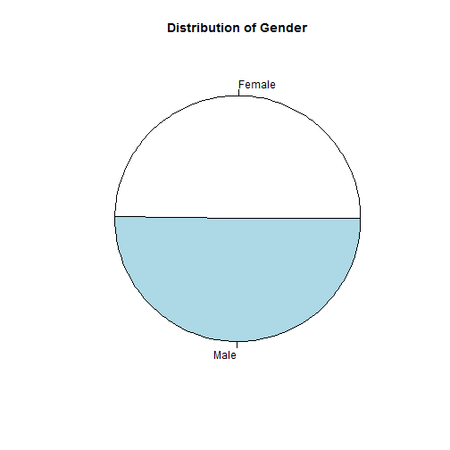
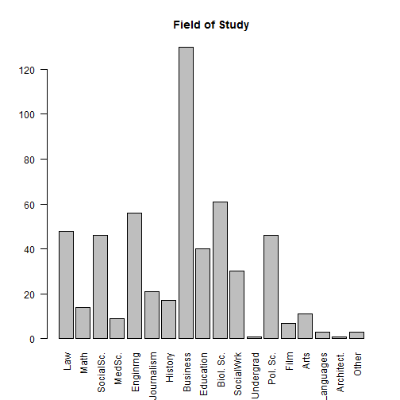
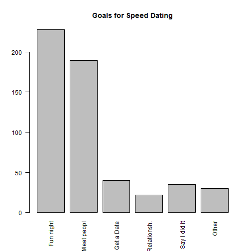
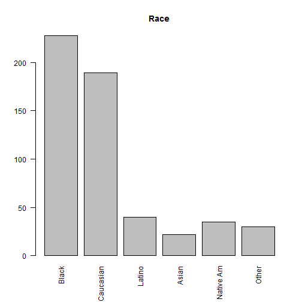

<center></center>


# Introduction

As often happens in groups of 5 males, the conversation about what to analyze for the Big Data & Analytics course quickly driften towards girls as the main topic. Instead of feeling quilty about that, we decided to combine the two and help the 4 singles in our group to understand their chances on the singles market better.  The dataset we will use for this exercise is a set of speed dating data gathered by Raymond Fisman, et al. (2006) at Columbia University. The data is made up by survey evaluations of 551 speed dating events, for which 18 variables are collected. The data includes the following characteristics of these speed dates:
<br>- Detailed profile of each speed dating participant, including wages, field of study, race and income
<br>- characteristics most important to them in a future partner 
<br>- scores of the persons they speed dated and whether there were regular follow ups after the speeddate
<br>
<br>We decided to use the data for two purposes to understand what kind of people join speeddating events, and thus whether it is worthwhile to attend such an event. We will thus analyze the characteristics of people attending and create a number of generic profiles of typical people attending.
<br>

###Process Description

<br>
The initial stage of our project was to set up a proper process before actually analyzing the dataset with R. We came up with the following approach:
<br>1. Review the information in the csv-dataset
<br>2. Define the business problem and specify which exact analyses are required
<br>3. Transform the dataset, in order to make it more useful for the purpose of the exercise (e.g., transformed non-numerical entries in converted them into numerical values)
<br>4. Conduct the analyses
<br>5. Perform quality checks for the analyses
<br>6. Qualitatively answer the business questions at hand
<br>

###Description of the data

<br>
The data we worked with is from a public source (https://www.kaggle.com/annavictoria/speed-dating-experiment). The original source is from an experiment conducted at Columbia Business School. The initial purpose of the analysis was to better understand the “Gender Differences in Mate Selection: Evidence From a Speed Dating Experiment”. 
<br>The data is in a table format. Columns comprise different characteristics of the participants (e.g., gender, income, background, race). In the initial dataset each row comprise a date with another person. However, for simplification reasons, we manually adjusted the data so that each line only represents a person (characterized by a unique ID). Hence, our analysis only assesses information about the participants – we’re less concerned about the quality or outcome of the dates.
<br>

###Business Purpose

<br>
Since the exercise requires us to apply data within a business context, we’ll focus our assessment on 2 main purposes. We take the standpoint of a speed dating agency, which – based on historical data – wants to better understand its clientele.
<br>First of all, our agency wants to create an advertising campaign to attract more people to join our events. In order to make statements about our client base, we initially need to use descriptive analysis to retrieve basic information about our current customers. We are specifically interested in the following information: 
<br>Gender distribution: Many speed dating agencies are struggling to keep a fair share of women and men in their database. If we can prove that we have an equal share of genders, this makes our agency significantly more interesting
<br>Occupation: It would be great if we could prove that we have a certain number of members in all different professions/ income brackets. This will help us to position our agency towards a certain clientele (e.g., as done by “elitepartner.de” in Germany).
<br>Purpose of the speed dating: We need to better understand, what we can claim towards our potential members. Are we an agency focusing on one-night-stands or do we seriously claim to create couples for life?
<br>Race: Since people have preferences towards dating people with certain races (e.g., Native American, Asian), we need to assess which races our current membership is composed of.
<br>

###Descriptive statistics

<br>
The table below shows data from the first 50 respondents:
<br>
<br>

<!-- Table generated in R 3.3.2 by googleVis 0.6.1 package -->
<!-- Tue Jan 31 09:44:00 2017 -->


<!-- jsHeader -->
<script type="text/javascript">
 
// jsData 
function gvisDataTableID272c72397b77 () {
var data = new google.visualization.DataTable();
var datajson =
[
 [
1,
0,
10,
4,
32,
1,
4,
21,
2,
4,
2,
7,
1,
6,
8,
8,
8,
7,
"1"
],
[
2,
0,
10,
2,
15,
1,
2,
24,
2,
5,
1,
5,
1,
7,
5,
10,
8,
3,
"2"
],
[
3,
0,
10,
0,
1,
2,
2,
25,
8,
4,
6,
3,
1,
8,
9,
8,
9,
8,
"3"
],
[
4,
0,
10,
2,
15,
1,
2,
23,
1,
1,
1,
5,
1,
7,
8,
9,
7,
8,
"4"
],
[
5,
0,
10,
2,
15,
1,
2,
21,
8,
1,
2,
4,
1,
6,
3,
6,
10,
8,
"5"
],
[
6,
0,
10,
2,
15,
1,
4,
23,
1,
1,
1,
3,
1,
5,
7,
8,
9,
5,
"6"
],
[
7,
0,
10,
2,
15,
1,
4,
22,
2,
4,
1,
5,
1,
6,
6,
5,
7,
7,
"7"
],
[
8,
0,
10,
8,
49,
13,
2,
25,
1,
1,
1,
5,
1,
7,
4,
8,
8,
8,
"8"
],
[
9,
0,
10,
7,
47,
13,
6,
26,
1,
1,
1,
4,
1,
7,
6,
10,
7,
7,
"9"
],
[
10,
0,
10,
2,
15,
13,
2,
26,
4,
4,
2,
6,
1,
6,
8,
10,
6,
9,
"10"
],
[
11,
1,
10,
0,
1,
8,
2,
27,
7,
3,
1,
5,
4,
8,
9,
7,
8,
5,
"11"
],
[
12,
1,
10,
2,
15,
1,
2,
22,
1,
1,
1,
1,
1,
9,
9,
9,
10,
9,
"12"
],
[
13,
1,
10,
4,
32,
1,
4,
22,
3,
5,
2,
7,
1,
4,
7,
8,
8,
3,
"13"
],
[
14,
1,
10,
8,
49,
1,
2,
23,
1,
1,
2,
4,
1,
9,
9,
9,
9,
9,
"14"
],
[
15,
1,
10,
3,
25,
1,
3,
24,
3,
1,
1,
4,
1,
7,
7,
7,
9,
9,
"15"
],
[
16,
1,
10,
2,
15,
8,
2,
25,
9,
2,
1,
5,
1,
6,
6,
8,
8,
6,
"16"
],
[
17,
1,
10,
1,
6,
13,
2,
30,
1,
1,
3,
3,
2,
7,
7,
6,
8,
4,
"17"
],
[
18,
1,
10,
1,
6,
8,
2,
27,
8,
8,
1,
6,
1,
6,
8,
6,
8,
9,
"18"
],
[
19,
1,
10,
9,
50,
8,
2,
28,
1,
1,
4,
1,
1,
10,
6,
10,
10,
10,
"19"
],
[
20,
1,
10,
1,
6,
8,
2,
24,
1,
1,
1,
1,
1,
7,
7,
10,
10,
10,
"20"
],
[
21,
0,
16,
0,
1,
5,
4,
21,
8,
10,
6,
7,
4,
5,
9,
7,
9,
10,
"21"
],
[
22,
0,
16,
2,
8,
9,
1,
27,
1,
2,
1,
6,
2,
7,
8,
7,
8,
7,
"22"
],
[
23,
0,
16,
3,
14,
3,
4,
21,
9,
6,
1,
1,
1,
5,
8,
6,
7,
8,
"23"
],
[
24,
0,
16,
0,
1,
11,
2,
27,
2,
3,
2,
6,
4,
7,
9,
9,
8,
8,
"24"
],
[
25,
0,
16,
0,
1,
11,
2,
25,
10,
2,
1,
5,
2,
7,
9,
7,
8,
6,
"25"
],
[
26,
0,
16,
0,
1,
11,
2,
23,
2,
4,
1,
5,
2,
7,
8,
8,
8,
8,
"26"
],
[
27,
0,
16,
2,
8,
3,
3,
22,
1,
5,
1,
6,
2,
6,
6,
7,
7,
7,
"27"
],
[
28,
0,
16,
1,
3,
3,
2,
26,
0,
0,
0,
0,
0,
0,
0,
0,
0,
0,
"28"
],
[
29,
0,
16,
2,
8,
11,
2,
22,
4,
5,
1,
6,
1,
6,
9,
8,
7,
8,
"29"
],
[
30,
0,
16,
2,
8,
1,
2,
23,
2,
4,
1,
7,
2,
7,
8,
9,
8,
8,
"30"
],
[
31,
0,
16,
4,
20,
1,
2,
24,
4,
8,
1,
4,
3,
8,
8,
9,
8,
9,
"31"
],
[
32,
0,
16,
0,
1,
3,
4,
27,
1,
1,
1,
4,
2,
7,
5,
9,
9,
7,
"32"
],
[
33,
0,
16,
0,
1,
3,
2,
30,
4,
8,
6,
6,
1,
6,
8,
6,
8,
8,
"33"
],
[
34,
0,
16,
2,
8,
8,
4,
21,
2,
2,
1,
6,
2,
7,
7,
7,
7,
8,
"34"
],
[
35,
0,
16,
5,
26,
2,
2,
25,
9,
7,
1,
6,
3,
8,
9,
9,
9,
7,
"35"
],
[
36,
0,
16,
2,
8,
2,
2,
26,
7,
8,
2,
5,
2,
8,
7,
8,
8,
6,
"36"
],
[
37,
0,
16,
2,
8,
3,
2,
27,
5,
8,
2,
6,
2,
7,
8,
7,
9,
5,
"37"
],
[
38,
0,
16,
3,
14,
1,
1,
23,
8,
1,
1,
4,
3,
8,
2,
7,
8,
8,
"38"
],
[
39,
0,
16,
1,
3,
1,
3,
24,
6,
4,
5,
6,
4,
6,
9,
6,
8,
7,
"39"
],
[
40,
1,
19,
0,
1,
0,
4,
25,
9,
6,
2,
7,
7,
3,
10,
8,
9,
5,
"40"
],
[
41,
1,
19,
0,
1,
1,
4,
30,
1,
1,
2,
6,
5,
5,
7,
5,
8,
5,
"41"
],
[
42,
1,
19,
0,
1,
5,
4,
23,
1,
6,
2,
7,
4,
6,
9,
6,
8,
4,
"42"
],
[
43,
1,
19,
1,
2,
8,
2,
24,
1,
1,
6,
6,
3,
3,
8,
3,
7,
2,
"43"
],
[
44,
1,
19,
4,
16,
3,
2,
24,
3,
3,
1,
3,
1,
7,
9,
8,
9,
9,
"44"
],
[
45,
1,
19,
4,
16,
8,
2,
28,
6,
6,
2,
6,
3,
7,
8,
6,
8,
7,
"45"
],
[
46,
1,
19,
4,
16,
8,
2,
26,
2,
3,
2,
6,
2,
7,
8,
5,
7,
7,
"46"
],
[
47,
1,
19,
1,
2,
8,
2,
30,
2,
2,
1,
6,
1,
8,
7,
9,
9,
3,
"47"
],
[
48,
1,
19,
1,
2,
12,
2,
22,
9,
2,
1,
5,
2,
7,
9,
6,
7,
6,
"48"
],
[
49,
1,
19,
6,
27,
8,
4,
25,
1,
3,
1,
3,
2,
7,
10,
10,
10,
8,
"49"
],
[
50,
1,
19,
4,
16,
1,
1,
27,
4,
4,
6,
6,
2,
8,
9,
9,
10,
8,
"50"
] 
];
data.addColumn('number','iid');
data.addColumn('number','gender');
data.addColumn('number','dates');
data.addColumn('number','match');
data.addColumn('number','per_match');
data.addColumn('number','field_cd');
data.addColumn('number','race');
data.addColumn('number','age');
data.addColumn('number','imprace');
data.addColumn('number','imprelig');
data.addColumn('number','goal');
data.addColumn('number','date');
data.addColumn('number','go_out');
data.addColumn('number','attr3_1');
data.addColumn('number','sinc3_1');
data.addColumn('number','fun3_1');
data.addColumn('number','intel3_1');
data.addColumn('number','amb3_1');
data.addColumn('string','Variables');
data.addRows(datajson);
return(data);
}
 
// jsDrawChart
function drawChartTableID272c72397b77() {
var data = gvisDataTableID272c72397b77();
var options = {};
options["allowHtml"] = true;
options["showRowNumber"] = true;
options["width"] = 1220;
options["height"] = 400;
options["allowHTML"] = true;
options["page"] = "disable";

    var chart = new google.visualization.Table(
    document.getElementById('TableID272c72397b77')
    );
    chart.draw(data,options);
    

}
  
 
// jsDisplayChart
(function() {
var pkgs = window.__gvisPackages = window.__gvisPackages || [];
var callbacks = window.__gvisCallbacks = window.__gvisCallbacks || [];
var chartid = "table";
  
// Manually see if chartid is in pkgs (not all browsers support Array.indexOf)
var i, newPackage = true;
for (i = 0; newPackage && i < pkgs.length; i++) {
if (pkgs[i] === chartid)
newPackage = false;
}
if (newPackage)
  pkgs.push(chartid);
  
// Add the drawChart function to the global list of callbacks
callbacks.push(drawChartTableID272c72397b77);
})();
function displayChartTableID272c72397b77() {
  var pkgs = window.__gvisPackages = window.__gvisPackages || [];
  var callbacks = window.__gvisCallbacks = window.__gvisCallbacks || [];
  window.clearTimeout(window.__gvisLoad);
  // The timeout is set to 100 because otherwise the container div we are
  // targeting might not be part of the document yet
  window.__gvisLoad = setTimeout(function() {
  var pkgCount = pkgs.length;
  google.load("visualization", "1", { packages:pkgs, callback: function() {
  if (pkgCount != pkgs.length) {
  // Race condition where another setTimeout call snuck in after us; if
  // that call added a package, we must not shift its callback
  return;
}
while (callbacks.length > 0)
callbacks.shift()();
} });
}, 100);
}
 
// jsFooter
</script>
 
<!-- jsChart -->  
<script type="text/javascript" src="https://www.google.com/jsapi?callback=displayChartTableID272c72397b77"></script>
 
<!-- divChart -->
  
<div id="TableID272c72397b77" 
  style="width: 1220; height: 400;">
</div>
<br>

The following pie chart shows us the gender distribution:
<br>




We have displayed the data


The bar chart below shows the educational backgrounds:
<br>

<br>First, we displayed the data by field of study: As the experimentation was run with MBA's students most of the candidates have a business background, the next most representative's population are from biology and engineering background. The last group are from law, social science and political science. These 3 groups represent more than 80% of our sample.

<br>
The following bar chart shows us the distribution on why the people wanted to go on a date:
<br>



<br>Second, we wanted to know what is the goal that the candidates are looking for when coming to speed dating: Surprisingly most of the candidates were looking for a one night or just meet other people.
 

The following histogram shows the self reported race:
<br>

Third we have segmented the candidates by race to see if there is any ethnicity influence in our results: The biggest populations are black and Caucasian. 

###Grouping typical speed daters together


# The Data

First we load the data to use (see the raw .Rmd file to change the data file as needed):


```r
# Please ENTER the name of the file with the data used. The file should be a
# .csv with one row per observation (e.g. person) and one column per
# attribute. Do not add .csv at the end, make sure the data are numeric.
datafile_name = "./Data/Testdata.csv"

# Please enter the minimum number below which you would like not to print -
# this makes the readability of the tables easier. Default values are either
# 10e6 (to print everything) or 0.5. Try both to see the difference.
MIN_VALUE = 0.5

# Please enter the maximum number of observations to show in the report and
# slides.  DEFAULT is 10. If the number is large the report may be slow.
max_data_report = 10
```


# Part 1: Key Customer Characteristics


```r
# Please ENTER then original raw attributes to use.  Please use numbers, not
# column names, e.g. c(1:5, 7, 8) uses columns 1,2,3,4,5,7,8
factor_attributes_used = c(8:17)

# Please ENTER the selection criterions for the factors to use.  Choices:
# 'eigenvalue', 'variance', 'manual'
factor_selectionciterion = "manual"

# Please ENTER the desired minumum variance explained (Only used in case
# 'variance' is the factor selection criterion used).
minimum_variance_explained = 65  # between 1 and 100

# Please ENTER the number of factors to use (Only used in case 'manual' is
# the factor selection criterion used).
manual_numb_factors_used = 7

# Please ENTER the rotation eventually used (e.g. 'none', 'varimax',
# 'quatimax', 'promax', 'oblimin', 'simplimax', and 'cluster' - see
# help(principal)). Default is 'varimax'
rotation_used = "varimax"
```


## Steps 1-2: Check the Data 


Start by some basic visual exploration of, say, a few data:

<!--html_preserve--><div class="formattable_container"><table class="table table-condensed">
 <thead>
  <tr>
   <th style="text-align:left;">   </th>
   <th style="text-align:right;"> Date 01 </th>
   <th style="text-align:right;"> Date 02 </th>
   <th style="text-align:right;"> Date 03 </th>
   <th style="text-align:right;"> Date 04 </th>
   <th style="text-align:right;"> Date 05 </th>
   <th style="text-align:right;"> Date 06 </th>
   <th style="text-align:right;"> Date 07 </th>
   <th style="text-align:right;"> Date 08 </th>
   <th style="text-align:right;"> Date 09 </th>
   <th style="text-align:right;"> Date 10 </th>
  </tr>
 </thead>
<tbody>
  <tr>
   <td style="text-align:left;"> age </td>
   <td style="text-align:right;"> <span style="display: inline-block; direction: rtl; border-radius: 4px; padding-right: 2px; background-color: #EEEEEE; width: 100.00%">21</span> </td>
   <td style="text-align:right;"> <span style="display: inline-block; direction: rtl; border-radius: 4px; padding-right: 2px; background-color: #EEEEEE; width: 100.00%">24</span> </td>
   <td style="text-align:right;"> <span style="display: inline-block; direction: rtl; border-radius: 4px; padding-right: 2px; background-color: #EEEEEE; width: 100.00%">25</span> </td>
   <td style="text-align:right;"> <span style="display: inline-block; direction: rtl; border-radius: 4px; padding-right: 2px; background-color: #EEEEEE; width: 100.00%">23</span> </td>
   <td style="text-align:right;"> <span style="display: inline-block; direction: rtl; border-radius: 4px; padding-right: 2px; background-color: #EEEEEE; width: 100.00%">21</span> </td>
   <td style="text-align:right;"> <span style="display: inline-block; direction: rtl; border-radius: 4px; padding-right: 2px; background-color: #EEEEEE; width: 100.00%">23</span> </td>
   <td style="text-align:right;"> <span style="display: inline-block; direction: rtl; border-radius: 4px; padding-right: 2px; background-color: #EEEEEE; width: 100.00%">22</span> </td>
   <td style="text-align:right;"> <span style="display: inline-block; direction: rtl; border-radius: 4px; padding-right: 2px; background-color: #EEEEEE; width: 100.00%">25</span> </td>
   <td style="text-align:right;"> <span style="display: inline-block; direction: rtl; border-radius: 4px; padding-right: 2px; background-color: #EEEEEE; width: 100.00%">26</span> </td>
   <td style="text-align:right;"> <span style="display: inline-block; direction: rtl; border-radius: 4px; padding-right: 2px; background-color: #EEEEEE; width: 100.00%">26</span> </td>
  </tr>
  <tr>
   <td style="text-align:left;"> imprace </td>
   <td style="text-align:right;"> <span style="display: inline-block; direction: rtl; border-radius: 4px; padding-right: 2px; background-color: #EEEEEE; width: 14.50%">2</span> </td>
   <td style="text-align:right;"> <span style="display: inline-block; direction: rtl; border-radius: 4px; padding-right: 2px; background-color: #EEEEEE; width: 13.91%">2</span> </td>
   <td style="text-align:right;"> <span style="display: inline-block; direction: rtl; border-radius: 4px; padding-right: 2px; background-color: #EEEEEE; width: 36.25%">8</span> </td>
   <td style="text-align:right;"> <span style="display: inline-block; direction: rtl; border-radius: 4px; padding-right: 2px; background-color: #EEEEEE; width: 10.00%">1</span> </td>
   <td style="text-align:right;"> <span style="display: inline-block; direction: rtl; border-radius: 4px; padding-right: 2px; background-color: #EEEEEE; width: 41.50%">8</span> </td>
   <td style="text-align:right;"> <span style="display: inline-block; direction: rtl; border-radius: 4px; padding-right: 2px; background-color: #EEEEEE; width: 10.00%">1</span> </td>
   <td style="text-align:right;"> <span style="display: inline-block; direction: rtl; border-radius: 4px; padding-right: 2px; background-color: #EEEEEE; width: 14.29%">2</span> </td>
   <td style="text-align:right;"> <span style="display: inline-block; direction: rtl; border-radius: 4px; padding-right: 2px; background-color: #EEEEEE; width: 10.00%">1</span> </td>
   <td style="text-align:right;"> <span style="display: inline-block; direction: rtl; border-radius: 4px; padding-right: 2px; background-color: #EEEEEE; width: 10.00%">1</span> </td>
   <td style="text-align:right;"> <span style="display: inline-block; direction: rtl; border-radius: 4px; padding-right: 2px; background-color: #EEEEEE; width: 20.80%">4</span> </td>
  </tr>
  <tr>
   <td style="text-align:left;"> imprelig </td>
   <td style="text-align:right;"> <span style="display: inline-block; direction: rtl; border-radius: 4px; padding-right: 2px; background-color: #EEEEEE; width: 23.50%">4</span> </td>
   <td style="text-align:right;"> <span style="display: inline-block; direction: rtl; border-radius: 4px; padding-right: 2px; background-color: #EEEEEE; width: 25.65%">5</span> </td>
   <td style="text-align:right;"> <span style="display: inline-block; direction: rtl; border-radius: 4px; padding-right: 2px; background-color: #EEEEEE; width: 21.25%">4</span> </td>
   <td style="text-align:right;"> <span style="display: inline-block; direction: rtl; border-radius: 4px; padding-right: 2px; background-color: #EEEEEE; width: 10.00%">1</span> </td>
   <td style="text-align:right;"> <span style="display: inline-block; direction: rtl; border-radius: 4px; padding-right: 2px; background-color: #EEEEEE; width: 10.00%">1</span> </td>
   <td style="text-align:right;"> <span style="display: inline-block; direction: rtl; border-radius: 4px; padding-right: 2px; background-color: #EEEEEE; width: 10.00%">1</span> </td>
   <td style="text-align:right;"> <span style="display: inline-block; direction: rtl; border-radius: 4px; padding-right: 2px; background-color: #EEEEEE; width: 22.86%">4</span> </td>
   <td style="text-align:right;"> <span style="display: inline-block; direction: rtl; border-radius: 4px; padding-right: 2px; background-color: #EEEEEE; width: 10.00%">1</span> </td>
   <td style="text-align:right;"> <span style="display: inline-block; direction: rtl; border-radius: 4px; padding-right: 2px; background-color: #EEEEEE; width: 10.00%">1</span> </td>
   <td style="text-align:right;"> <span style="display: inline-block; direction: rtl; border-radius: 4px; padding-right: 2px; background-color: #EEEEEE; width: 20.80%">4</span> </td>
  </tr>
  <tr>
   <td style="text-align:left;"> goal </td>
   <td style="text-align:right;"> <span style="display: inline-block; direction: rtl; border-radius: 4px; padding-right: 2px; background-color: #EEEEEE; width: 14.50%">2</span> </td>
   <td style="text-align:right;"> <span style="display: inline-block; direction: rtl; border-radius: 4px; padding-right: 2px; background-color: #EEEEEE; width: 10.00%">1</span> </td>
   <td style="text-align:right;"> <span style="display: inline-block; direction: rtl; border-radius: 4px; padding-right: 2px; background-color: #EEEEEE; width: 28.75%">6</span> </td>
   <td style="text-align:right;"> <span style="display: inline-block; direction: rtl; border-radius: 4px; padding-right: 2px; background-color: #EEEEEE; width: 10.00%">1</span> </td>
   <td style="text-align:right;"> <span style="display: inline-block; direction: rtl; border-radius: 4px; padding-right: 2px; background-color: #EEEEEE; width: 14.50%">2</span> </td>
   <td style="text-align:right;"> <span style="display: inline-block; direction: rtl; border-radius: 4px; padding-right: 2px; background-color: #EEEEEE; width: 10.00%">1</span> </td>
   <td style="text-align:right;"> <span style="display: inline-block; direction: rtl; border-radius: 4px; padding-right: 2px; background-color: #EEEEEE; width: 10.00%">1</span> </td>
   <td style="text-align:right;"> <span style="display: inline-block; direction: rtl; border-radius: 4px; padding-right: 2px; background-color: #EEEEEE; width: 10.00%">1</span> </td>
   <td style="text-align:right;"> <span style="display: inline-block; direction: rtl; border-radius: 4px; padding-right: 2px; background-color: #EEEEEE; width: 10.00%">1</span> </td>
   <td style="text-align:right;"> <span style="display: inline-block; direction: rtl; border-radius: 4px; padding-right: 2px; background-color: #EEEEEE; width: 13.60%">2</span> </td>
  </tr>
  <tr>
   <td style="text-align:left;"> date </td>
   <td style="text-align:right;"> <span style="display: inline-block; direction: rtl; border-radius: 4px; padding-right: 2px; background-color: #EEEEEE; width: 37.00%">7</span> </td>
   <td style="text-align:right;"> <span style="display: inline-block; direction: rtl; border-radius: 4px; padding-right: 2px; background-color: #EEEEEE; width: 25.65%">5</span> </td>
   <td style="text-align:right;"> <span style="display: inline-block; direction: rtl; border-radius: 4px; padding-right: 2px; background-color: #EEEEEE; width: 17.50%">3</span> </td>
   <td style="text-align:right;"> <span style="display: inline-block; direction: rtl; border-radius: 4px; padding-right: 2px; background-color: #EEEEEE; width: 26.36%">5</span> </td>
   <td style="text-align:right;"> <span style="display: inline-block; direction: rtl; border-radius: 4px; padding-right: 2px; background-color: #EEEEEE; width: 23.50%">4</span> </td>
   <td style="text-align:right;"> <span style="display: inline-block; direction: rtl; border-radius: 4px; padding-right: 2px; background-color: #EEEEEE; width: 18.18%">3</span> </td>
   <td style="text-align:right;"> <span style="display: inline-block; direction: rtl; border-radius: 4px; padding-right: 2px; background-color: #EEEEEE; width: 27.14%">5</span> </td>
   <td style="text-align:right;"> <span style="display: inline-block; direction: rtl; border-radius: 4px; padding-right: 2px; background-color: #EEEEEE; width: 25.00%">5</span> </td>
   <td style="text-align:right;"> <span style="display: inline-block; direction: rtl; border-radius: 4px; padding-right: 2px; background-color: #EEEEEE; width: 20.80%">4</span> </td>
   <td style="text-align:right;"> <span style="display: inline-block; direction: rtl; border-radius: 4px; padding-right: 2px; background-color: #EEEEEE; width: 28.00%">6</span> </td>
  </tr>
  <tr>
   <td style="text-align:left;"> go_out </td>
   <td style="text-align:right;"> <span style="display: inline-block; direction: rtl; border-radius: 4px; padding-right: 2px; background-color: #EEEEEE; width: 10.00%">1</span> </td>
   <td style="text-align:right;"> <span style="display: inline-block; direction: rtl; border-radius: 4px; padding-right: 2px; background-color: #EEEEEE; width: 10.00%">1</span> </td>
   <td style="text-align:right;"> <span style="display: inline-block; direction: rtl; border-radius: 4px; padding-right: 2px; background-color: #EEEEEE; width: 10.00%">1</span> </td>
   <td style="text-align:right;"> <span style="display: inline-block; direction: rtl; border-radius: 4px; padding-right: 2px; background-color: #EEEEEE; width: 10.00%">1</span> </td>
   <td style="text-align:right;"> <span style="display: inline-block; direction: rtl; border-radius: 4px; padding-right: 2px; background-color: #EEEEEE; width: 10.00%">1</span> </td>
   <td style="text-align:right;"> <span style="display: inline-block; direction: rtl; border-radius: 4px; padding-right: 2px; background-color: #EEEEEE; width: 10.00%">1</span> </td>
   <td style="text-align:right;"> <span style="display: inline-block; direction: rtl; border-radius: 4px; padding-right: 2px; background-color: #EEEEEE; width: 10.00%">1</span> </td>
   <td style="text-align:right;"> <span style="display: inline-block; direction: rtl; border-radius: 4px; padding-right: 2px; background-color: #EEEEEE; width: 10.00%">1</span> </td>
   <td style="text-align:right;"> <span style="display: inline-block; direction: rtl; border-radius: 4px; padding-right: 2px; background-color: #EEEEEE; width: 10.00%">1</span> </td>
   <td style="text-align:right;"> <span style="display: inline-block; direction: rtl; border-radius: 4px; padding-right: 2px; background-color: #EEEEEE; width: 10.00%">1</span> </td>
  </tr>
  <tr>
   <td style="text-align:left;"> attr3_1 </td>
   <td style="text-align:right;"> <span style="display: inline-block; direction: rtl; border-radius: 4px; padding-right: 2px; background-color: #EEEEEE; width: 32.50%">6</span> </td>
   <td style="text-align:right;"> <span style="display: inline-block; direction: rtl; border-radius: 4px; padding-right: 2px; background-color: #EEEEEE; width: 33.48%">7</span> </td>
   <td style="text-align:right;"> <span style="display: inline-block; direction: rtl; border-radius: 4px; padding-right: 2px; background-color: #EEEEEE; width: 36.25%">8</span> </td>
   <td style="text-align:right;"> <span style="display: inline-block; direction: rtl; border-radius: 4px; padding-right: 2px; background-color: #EEEEEE; width: 34.55%">7</span> </td>
   <td style="text-align:right;"> <span style="display: inline-block; direction: rtl; border-radius: 4px; padding-right: 2px; background-color: #EEEEEE; width: 32.50%">6</span> </td>
   <td style="text-align:right;"> <span style="display: inline-block; direction: rtl; border-radius: 4px; padding-right: 2px; background-color: #EEEEEE; width: 26.36%">5</span> </td>
   <td style="text-align:right;"> <span style="display: inline-block; direction: rtl; border-radius: 4px; padding-right: 2px; background-color: #EEEEEE; width: 31.43%">6</span> </td>
   <td style="text-align:right;"> <span style="display: inline-block; direction: rtl; border-radius: 4px; padding-right: 2px; background-color: #EEEEEE; width: 32.50%">7</span> </td>
   <td style="text-align:right;"> <span style="display: inline-block; direction: rtl; border-radius: 4px; padding-right: 2px; background-color: #EEEEEE; width: 31.60%">7</span> </td>
   <td style="text-align:right;"> <span style="display: inline-block; direction: rtl; border-radius: 4px; padding-right: 2px; background-color: #EEEEEE; width: 28.00%">6</span> </td>
  </tr>
  <tr>
   <td style="text-align:left;"> sinc3_1 </td>
   <td style="text-align:right;"> <span style="display: inline-block; direction: rtl; border-radius: 4px; padding-right: 2px; background-color: #EEEEEE; width: 41.50%">8</span> </td>
   <td style="text-align:right;"> <span style="display: inline-block; direction: rtl; border-radius: 4px; padding-right: 2px; background-color: #EEEEEE; width: 25.65%">5</span> </td>
   <td style="text-align:right;"> <span style="display: inline-block; direction: rtl; border-radius: 4px; padding-right: 2px; background-color: #EEEEEE; width: 40.00%">9</span> </td>
   <td style="text-align:right;"> <span style="display: inline-block; direction: rtl; border-radius: 4px; padding-right: 2px; background-color: #EEEEEE; width: 38.64%">8</span> </td>
   <td style="text-align:right;"> <span style="display: inline-block; direction: rtl; border-radius: 4px; padding-right: 2px; background-color: #EEEEEE; width: 19.00%">3</span> </td>
   <td style="text-align:right;"> <span style="display: inline-block; direction: rtl; border-radius: 4px; padding-right: 2px; background-color: #EEEEEE; width: 34.55%">7</span> </td>
   <td style="text-align:right;"> <span style="display: inline-block; direction: rtl; border-radius: 4px; padding-right: 2px; background-color: #EEEEEE; width: 31.43%">6</span> </td>
   <td style="text-align:right;"> <span style="display: inline-block; direction: rtl; border-radius: 4px; padding-right: 2px; background-color: #EEEEEE; width: 21.25%">4</span> </td>
   <td style="text-align:right;"> <span style="display: inline-block; direction: rtl; border-radius: 4px; padding-right: 2px; background-color: #EEEEEE; width: 28.00%">6</span> </td>
   <td style="text-align:right;"> <span style="display: inline-block; direction: rtl; border-radius: 4px; padding-right: 2px; background-color: #EEEEEE; width: 35.20%">8</span> </td>
  </tr>
  <tr>
   <td style="text-align:left;"> fun3_1 </td>
   <td style="text-align:right;"> <span style="display: inline-block; direction: rtl; border-radius: 4px; padding-right: 2px; background-color: #EEEEEE; width: 41.50%">8</span> </td>
   <td style="text-align:right;"> <span style="display: inline-block; direction: rtl; border-radius: 4px; padding-right: 2px; background-color: #EEEEEE; width: 45.22%">10</span> </td>
   <td style="text-align:right;"> <span style="display: inline-block; direction: rtl; border-radius: 4px; padding-right: 2px; background-color: #EEEEEE; width: 36.25%">8</span> </td>
   <td style="text-align:right;"> <span style="display: inline-block; direction: rtl; border-radius: 4px; padding-right: 2px; background-color: #EEEEEE; width: 42.73%">9</span> </td>
   <td style="text-align:right;"> <span style="display: inline-block; direction: rtl; border-radius: 4px; padding-right: 2px; background-color: #EEEEEE; width: 32.50%">6</span> </td>
   <td style="text-align:right;"> <span style="display: inline-block; direction: rtl; border-radius: 4px; padding-right: 2px; background-color: #EEEEEE; width: 38.64%">8</span> </td>
   <td style="text-align:right;"> <span style="display: inline-block; direction: rtl; border-radius: 4px; padding-right: 2px; background-color: #EEEEEE; width: 27.14%">5</span> </td>
   <td style="text-align:right;"> <span style="display: inline-block; direction: rtl; border-radius: 4px; padding-right: 2px; background-color: #EEEEEE; width: 36.25%">8</span> </td>
   <td style="text-align:right;"> <span style="display: inline-block; direction: rtl; border-radius: 4px; padding-right: 2px; background-color: #EEEEEE; width: 42.40%">10</span> </td>
   <td style="text-align:right;"> <span style="display: inline-block; direction: rtl; border-radius: 4px; padding-right: 2px; background-color: #EEEEEE; width: 42.40%">10</span> </td>
  </tr>
  <tr>
   <td style="text-align:left;"> intel3_1 </td>
   <td style="text-align:right;"> <span style="display: inline-block; direction: rtl; border-radius: 4px; padding-right: 2px; background-color: #EEEEEE; width: 41.50%">8</span> </td>
   <td style="text-align:right;"> <span style="display: inline-block; direction: rtl; border-radius: 4px; padding-right: 2px; background-color: #EEEEEE; width: 37.39%">8</span> </td>
   <td style="text-align:right;"> <span style="display: inline-block; direction: rtl; border-radius: 4px; padding-right: 2px; background-color: #EEEEEE; width: 40.00%">9</span> </td>
   <td style="text-align:right;"> <span style="display: inline-block; direction: rtl; border-radius: 4px; padding-right: 2px; background-color: #EEEEEE; width: 34.55%">7</span> </td>
   <td style="text-align:right;"> <span style="display: inline-block; direction: rtl; border-radius: 4px; padding-right: 2px; background-color: #EEEEEE; width: 50.50%">10</span> </td>
   <td style="text-align:right;"> <span style="display: inline-block; direction: rtl; border-radius: 4px; padding-right: 2px; background-color: #EEEEEE; width: 42.73%">9</span> </td>
   <td style="text-align:right;"> <span style="display: inline-block; direction: rtl; border-radius: 4px; padding-right: 2px; background-color: #EEEEEE; width: 35.71%">7</span> </td>
   <td style="text-align:right;"> <span style="display: inline-block; direction: rtl; border-radius: 4px; padding-right: 2px; background-color: #EEEEEE; width: 36.25%">8</span> </td>
   <td style="text-align:right;"> <span style="display: inline-block; direction: rtl; border-radius: 4px; padding-right: 2px; background-color: #EEEEEE; width: 31.60%">7</span> </td>
   <td style="text-align:right;"> <span style="display: inline-block; direction: rtl; border-radius: 4px; padding-right: 2px; background-color: #EEEEEE; width: 28.00%">6</span> </td>
  </tr>
</tbody>
</table></div><!--/html_preserve-->

The data we use here have the following descriptive statistics: 

<!--html_preserve--><div class="formattable_container"><table class="table table-condensed">
 <thead>
  <tr>
   <th style="text-align:left;">   </th>
   <th style="text-align:right;"> min </th>
   <th style="text-align:right;"> 25 percent </th>
   <th style="text-align:right;"> median </th>
   <th style="text-align:right;"> mean </th>
   <th style="text-align:right;"> 75 percent </th>
   <th style="text-align:right;"> max </th>
   <th style="text-align:right;"> std </th>
  </tr>
 </thead>
<tbody>
  <tr>
   <td style="text-align:left;"> age </td>
   <td style="text-align:right;"> <span style="display: inline-block; direction: rtl; border-radius: 4px; padding-right: 2px; background-color: #EEEEEE; width: 0.00%">0</span> </td>
   <td style="text-align:right;"> <span style="display: inline-block; direction: rtl; border-radius: 4px; padding-right: 2px; background-color: #EEEEEE; width: 100.00%">23.5</span> </td>
   <td style="text-align:right;"> <span style="display: inline-block; direction: rtl; border-radius: 4px; padding-right: 2px; background-color: #EEEEEE; width: 100.00%">26</span> </td>
   <td style="text-align:right;"> <span style="display: inline-block; direction: rtl; border-radius: 4px; padding-right: 2px; background-color: #EEEEEE; width: 100.00%">25.98</span> </td>
   <td style="text-align:right;"> <span style="display: inline-block; direction: rtl; border-radius: 4px; padding-right: 2px; background-color: #EEEEEE; width: 100.00%">28</span> </td>
   <td style="text-align:right;"> <span style="display: inline-block; direction: rtl; border-radius: 4px; padding-right: 2px; background-color: #EEEEEE; width: 100.00%">55</span> </td>
   <td style="text-align:right;"> <span style="display: inline-block; direction: rtl; border-radius: 4px; padding-right: 2px; background-color: #EEEEEE; width: 100.00%">4.89</span> </td>
  </tr>
  <tr>
   <td style="text-align:left;"> imprace </td>
   <td style="text-align:right;"> <span style="display: inline-block; direction: rtl; border-radius: 4px; padding-right: 2px; background-color: #EEEEEE; width: 0.00%">0</span> </td>
   <td style="text-align:right;"> <span style="display: inline-block; direction: rtl; border-radius: 4px; padding-right: 2px; background-color: #EEEEEE; width: 10.00%">1.0</span> </td>
   <td style="text-align:right;"> <span style="display: inline-block; direction: rtl; border-radius: 4px; padding-right: 2px; background-color: #EEEEEE; width: 13.75%">3</span> </td>
   <td style="text-align:right;"> <span style="display: inline-block; direction: rtl; border-radius: 4px; padding-right: 2px; background-color: #EEEEEE; width: 15.92%">3.69</span> </td>
   <td style="text-align:right;"> <span style="display: inline-block; direction: rtl; border-radius: 4px; padding-right: 2px; background-color: #EEEEEE; width: 23.85%">6</span> </td>
   <td style="text-align:right;"> <span style="display: inline-block; direction: rtl; border-radius: 4px; padding-right: 2px; background-color: #EEEEEE; width: 17.35%">10</span> </td>
   <td style="text-align:right;"> <span style="display: inline-block; direction: rtl; border-radius: 4px; padding-right: 2px; background-color: #EEEEEE; width: 51.30%">2.85</span> </td>
  </tr>
  <tr>
   <td style="text-align:left;"> imprelig </td>
   <td style="text-align:right;"> <span style="display: inline-block; direction: rtl; border-radius: 4px; padding-right: 2px; background-color: #EEEEEE; width: 0.00%">0</span> </td>
   <td style="text-align:right;"> <span style="display: inline-block; direction: rtl; border-radius: 4px; padding-right: 2px; background-color: #EEEEEE; width: 10.00%">1.0</span> </td>
   <td style="text-align:right;"> <span style="display: inline-block; direction: rtl; border-radius: 4px; padding-right: 2px; background-color: #EEEEEE; width: 13.75%">3</span> </td>
   <td style="text-align:right;"> <span style="display: inline-block; direction: rtl; border-radius: 4px; padding-right: 2px; background-color: #EEEEEE; width: 15.36%">3.54</span> </td>
   <td style="text-align:right;"> <span style="display: inline-block; direction: rtl; border-radius: 4px; padding-right: 2px; background-color: #EEEEEE; width: 23.85%">6</span> </td>
   <td style="text-align:right;"> <span style="display: inline-block; direction: rtl; border-radius: 4px; padding-right: 2px; background-color: #EEEEEE; width: 17.35%">10</span> </td>
   <td style="text-align:right;"> <span style="display: inline-block; direction: rtl; border-radius: 4px; padding-right: 2px; background-color: #EEEEEE; width: 50.11%">2.80</span> </td>
  </tr>
  <tr>
   <td style="text-align:left;"> goal </td>
   <td style="text-align:right;"> <span style="display: inline-block; direction: rtl; border-radius: 4px; padding-right: 2px; background-color: #EEEEEE; width: 0.00%">0</span> </td>
   <td style="text-align:right;"> <span style="display: inline-block; direction: rtl; border-radius: 4px; padding-right: 2px; background-color: #EEEEEE; width: 10.00%">1.0</span> </td>
   <td style="text-align:right;"> <span style="display: inline-block; direction: rtl; border-radius: 4px; padding-right: 2px; background-color: #EEEEEE; width: 10.00%">2</span> </td>
   <td style="text-align:right;"> <span style="display: inline-block; direction: rtl; border-radius: 4px; padding-right: 2px; background-color: #EEEEEE; width: 10.00%">2.12</span> </td>
   <td style="text-align:right;"> <span style="display: inline-block; direction: rtl; border-radius: 4px; padding-right: 2px; background-color: #EEEEEE; width: 10.00%">2</span> </td>
   <td style="text-align:right;"> <span style="display: inline-block; direction: rtl; border-radius: 4px; padding-right: 2px; background-color: #EEEEEE; width: 10.00%">6</span> </td>
   <td style="text-align:right;"> <span style="display: inline-block; direction: rtl; border-radius: 4px; padding-right: 2px; background-color: #EEEEEE; width: 18.12%">1.46</span> </td>
  </tr>
  <tr>
   <td style="text-align:left;"> date </td>
   <td style="text-align:right;"> <span style="display: inline-block; direction: rtl; border-radius: 4px; padding-right: 2px; background-color: #EEEEEE; width: 0.00%">0</span> </td>
   <td style="text-align:right;"> <span style="display: inline-block; direction: rtl; border-radius: 4px; padding-right: 2px; background-color: #EEEEEE; width: 22.00%">4.0</span> </td>
   <td style="text-align:right;"> <span style="display: inline-block; direction: rtl; border-radius: 4px; padding-right: 2px; background-color: #EEEEEE; width: 21.25%">5</span> </td>
   <td style="text-align:right;"> <span style="display: inline-block; direction: rtl; border-radius: 4px; padding-right: 2px; background-color: #EEEEEE; width: 20.52%">4.91</span> </td>
   <td style="text-align:right;"> <span style="display: inline-block; direction: rtl; border-radius: 4px; padding-right: 2px; background-color: #EEEEEE; width: 23.85%">6</span> </td>
   <td style="text-align:right;"> <span style="display: inline-block; direction: rtl; border-radius: 4px; padding-right: 2px; background-color: #EEEEEE; width: 11.84%">7</span> </td>
   <td style="text-align:right;"> <span style="display: inline-block; direction: rtl; border-radius: 4px; padding-right: 2px; background-color: #EEEEEE; width: 20.98%">1.58</span> </td>
  </tr>
  <tr>
   <td style="text-align:left;"> go_out </td>
   <td style="text-align:right;"> <span style="display: inline-block; direction: rtl; border-radius: 4px; padding-right: 2px; background-color: #EEEEEE; width: 0.00%">0</span> </td>
   <td style="text-align:right;"> <span style="display: inline-block; direction: rtl; border-radius: 4px; padding-right: 2px; background-color: #EEEEEE; width: 10.00%">1.0</span> </td>
   <td style="text-align:right;"> <span style="display: inline-block; direction: rtl; border-radius: 4px; padding-right: 2px; background-color: #EEEEEE; width: 10.00%">2</span> </td>
   <td style="text-align:right;"> <span style="display: inline-block; direction: rtl; border-radius: 4px; padding-right: 2px; background-color: #EEEEEE; width: 10.00%">2.12</span> </td>
   <td style="text-align:right;"> <span style="display: inline-block; direction: rtl; border-radius: 4px; padding-right: 2px; background-color: #EEEEEE; width: 13.46%">3</span> </td>
   <td style="text-align:right;"> <span style="display: inline-block; direction: rtl; border-radius: 4px; padding-right: 2px; background-color: #EEEEEE; width: 11.84%">7</span> </td>
   <td style="text-align:right;"> <span style="display: inline-block; direction: rtl; border-radius: 4px; padding-right: 2px; background-color: #EEEEEE; width: 10.00%">1.12</span> </td>
  </tr>
  <tr>
   <td style="text-align:left;"> attr3_1 </td>
   <td style="text-align:right;"> <span style="display: inline-block; direction: rtl; border-radius: 4px; padding-right: 2px; background-color: #EEEEEE; width: 0.00%">0</span> </td>
   <td style="text-align:right;"> <span style="display: inline-block; direction: rtl; border-radius: 4px; padding-right: 2px; background-color: #EEEEEE; width: 30.00%">6.0</span> </td>
   <td style="text-align:right;"> <span style="display: inline-block; direction: rtl; border-radius: 4px; padding-right: 2px; background-color: #EEEEEE; width: 28.75%">7</span> </td>
   <td style="text-align:right;"> <span style="display: inline-block; direction: rtl; border-radius: 4px; padding-right: 2px; background-color: #EEEEEE; width: 28.33%">6.98</span> </td>
   <td style="text-align:right;"> <span style="display: inline-block; direction: rtl; border-radius: 4px; padding-right: 2px; background-color: #EEEEEE; width: 30.77%">8</span> </td>
   <td style="text-align:right;"> <span style="display: inline-block; direction: rtl; border-radius: 4px; padding-right: 2px; background-color: #EEEEEE; width: 17.35%">10</span> </td>
   <td style="text-align:right;"> <span style="display: inline-block; direction: rtl; border-radius: 4px; padding-right: 2px; background-color: #EEEEEE; width: 22.65%">1.65</span> </td>
  </tr>
  <tr>
   <td style="text-align:left;"> sinc3_1 </td>
   <td style="text-align:right;"> <span style="display: inline-block; direction: rtl; border-radius: 4px; padding-right: 2px; background-color: #EEEEEE; width: 0.00%">0</span> </td>
   <td style="text-align:right;"> <span style="display: inline-block; direction: rtl; border-radius: 4px; padding-right: 2px; background-color: #EEEEEE; width: 34.00%">7.0</span> </td>
   <td style="text-align:right;"> <span style="display: inline-block; direction: rtl; border-radius: 4px; padding-right: 2px; background-color: #EEEEEE; width: 32.50%">8</span> </td>
   <td style="text-align:right;"> <span style="display: inline-block; direction: rtl; border-radius: 4px; padding-right: 2px; background-color: #EEEEEE; width: 32.75%">8.15</span> </td>
   <td style="text-align:right;"> <span style="display: inline-block; direction: rtl; border-radius: 4px; padding-right: 2px; background-color: #EEEEEE; width: 34.23%">9</span> </td>
   <td style="text-align:right;"> <span style="display: inline-block; direction: rtl; border-radius: 4px; padding-right: 2px; background-color: #EEEEEE; width: 17.35%">10</span> </td>
   <td style="text-align:right;"> <span style="display: inline-block; direction: rtl; border-radius: 4px; padding-right: 2px; background-color: #EEEEEE; width: 25.04%">1.75</span> </td>
  </tr>
  <tr>
   <td style="text-align:left;"> fun3_1 </td>
   <td style="text-align:right;"> <span style="display: inline-block; direction: rtl; border-radius: 4px; padding-right: 2px; background-color: #EEEEEE; width: 0.00%">0</span> </td>
   <td style="text-align:right;"> <span style="display: inline-block; direction: rtl; border-radius: 4px; padding-right: 2px; background-color: #EEEEEE; width: 34.00%">7.0</span> </td>
   <td style="text-align:right;"> <span style="display: inline-block; direction: rtl; border-radius: 4px; padding-right: 2px; background-color: #EEEEEE; width: 32.50%">8</span> </td>
   <td style="text-align:right;"> <span style="display: inline-block; direction: rtl; border-radius: 4px; padding-right: 2px; background-color: #EEEEEE; width: 30.60%">7.58</span> </td>
   <td style="text-align:right;"> <span style="display: inline-block; direction: rtl; border-radius: 4px; padding-right: 2px; background-color: #EEEEEE; width: 34.23%">9</span> </td>
   <td style="text-align:right;"> <span style="display: inline-block; direction: rtl; border-radius: 4px; padding-right: 2px; background-color: #EEEEEE; width: 17.35%">10</span> </td>
   <td style="text-align:right;"> <span style="display: inline-block; direction: rtl; border-radius: 4px; padding-right: 2px; background-color: #EEEEEE; width: 26.71%">1.82</span> </td>
  </tr>
  <tr>
   <td style="text-align:left;"> intel3_1 </td>
   <td style="text-align:right;"> <span style="display: inline-block; direction: rtl; border-radius: 4px; padding-right: 2px; background-color: #EEEEEE; width: 0.00%">0</span> </td>
   <td style="text-align:right;"> <span style="display: inline-block; direction: rtl; border-radius: 4px; padding-right: 2px; background-color: #EEEEEE; width: 38.00%">8.0</span> </td>
   <td style="text-align:right;"> <span style="display: inline-block; direction: rtl; border-radius: 4px; padding-right: 2px; background-color: #EEEEEE; width: 32.50%">8</span> </td>
   <td style="text-align:right;"> <span style="display: inline-block; direction: rtl; border-radius: 4px; padding-right: 2px; background-color: #EEEEEE; width: 33.12%">8.25</span> </td>
   <td style="text-align:right;"> <span style="display: inline-block; direction: rtl; border-radius: 4px; padding-right: 2px; background-color: #EEEEEE; width: 34.23%">9</span> </td>
   <td style="text-align:right;"> <span style="display: inline-block; direction: rtl; border-radius: 4px; padding-right: 2px; background-color: #EEEEEE; width: 17.35%">10</span> </td>
   <td style="text-align:right;"> <span style="display: inline-block; direction: rtl; border-radius: 4px; padding-right: 2px; background-color: #EEEEEE; width: 19.55%">1.52</span> </td>
  </tr>
</tbody>
</table></div><!--/html_preserve-->


## Step 3: Check Correlations

This is the correlation matrix of the customer responses to the 10 attitude questions - which are the only questions that we will use for the segmentation (see the case):

<!--html_preserve--><div class="formattable_container"><table class="table table-condensed">
 <thead>
  <tr>
   <th style="text-align:left;">   </th>
   <th style="text-align:right;"> age </th>
   <th style="text-align:right;"> imprace </th>
   <th style="text-align:right;"> imprelig </th>
   <th style="text-align:right;"> goal </th>
   <th style="text-align:right;"> date </th>
   <th style="text-align:right;"> go_out </th>
   <th style="text-align:right;"> attr3_1 </th>
   <th style="text-align:right;"> sinc3_1 </th>
   <th style="text-align:right;"> fun3_1 </th>
   <th style="text-align:right;"> intel3_1 </th>
  </tr>
 </thead>
<tbody>
  <tr>
   <td style="text-align:left;"> age </td>
   <td style="text-align:right;"> <span style="display: inline-block; direction: rtl; border-radius: 4px; padding-right: 2px; background-color: #EEEEEE; width: 100.00%">1.00</span> </td>
   <td style="text-align:right;"> <span style="display: inline-block; direction: rtl; border-radius: 4px; padding-right: 2px; background-color: #EEEEEE; width: 10.00%">-0.01</span> </td>
   <td style="text-align:right;"> <span style="display: inline-block; direction: rtl; border-radius: 4px; padding-right: 2px; background-color: #EEEEEE; width: 14.50%">0.05</span> </td>
   <td style="text-align:right;"> <span style="display: inline-block; direction: rtl; border-radius: 4px; padding-right: 2px; background-color: #EEEEEE; width: 24.40%">0.16</span> </td>
   <td style="text-align:right;"> <span style="display: inline-block; direction: rtl; border-radius: 4px; padding-right: 2px; background-color: #EEEEEE; width: 28.37%">0.22</span> </td>
   <td style="text-align:right;"> <span style="display: inline-block; direction: rtl; border-radius: 4px; padding-right: 2px; background-color: #EEEEEE; width: 24.69%">0.18</span> </td>
   <td style="text-align:right;"> <span style="display: inline-block; direction: rtl; border-radius: 4px; padding-right: 2px; background-color: #EEEEEE; width: 33.88%">0.28</span> </td>
   <td style="text-align:right;"> <span style="display: inline-block; direction: rtl; border-radius: 4px; padding-right: 2px; background-color: #EEEEEE; width: 27.80%">0.27</span> </td>
   <td style="text-align:right;"> <span style="display: inline-block; direction: rtl; border-radius: 4px; padding-right: 2px; background-color: #EEEEEE; width: 27.10%">0.19</span> </td>
   <td style="text-align:right;"> <span style="display: inline-block; direction: rtl; border-radius: 4px; padding-right: 2px; background-color: #EEEEEE; width: 36.13%">0.34</span> </td>
  </tr>
  <tr>
   <td style="text-align:left;"> imprace </td>
   <td style="text-align:right;"> <span style="display: inline-block; direction: rtl; border-radius: 4px; padding-right: 2px; background-color: #EEEEEE; width: 10.00%">-0.01</span> </td>
   <td style="text-align:right;"> <span style="display: inline-block; direction: rtl; border-radius: 4px; padding-right: 2px; background-color: #EEEEEE; width: 100.00%">1.00</span> </td>
   <td style="text-align:right;"> <span style="display: inline-block; direction: rtl; border-radius: 4px; padding-right: 2px; background-color: #EEEEEE; width: 49.60%">0.44</span> </td>
   <td style="text-align:right;"> <span style="display: inline-block; direction: rtl; border-radius: 4px; padding-right: 2px; background-color: #EEEEEE; width: 15.40%">-0.06</span> </td>
   <td style="text-align:right;"> <span style="display: inline-block; direction: rtl; border-radius: 4px; padding-right: 2px; background-color: #EEEEEE; width: 10.92%">0.03</span> </td>
   <td style="text-align:right;"> <span style="display: inline-block; direction: rtl; border-radius: 4px; padding-right: 2px; background-color: #EEEEEE; width: 10.00%">0.02</span> </td>
   <td style="text-align:right;"> <span style="display: inline-block; direction: rtl; border-radius: 4px; padding-right: 2px; background-color: #EEEEEE; width: 19.18%">0.12</span> </td>
   <td style="text-align:right;"> <span style="display: inline-block; direction: rtl; border-radius: 4px; padding-right: 2px; background-color: #EEEEEE; width: 13.96%">0.13</span> </td>
   <td style="text-align:right;"> <span style="display: inline-block; direction: rtl; border-radius: 4px; padding-right: 2px; background-color: #EEEEEE; width: 19.90%">0.11</span> </td>
   <td style="text-align:right;"> <span style="display: inline-block; direction: rtl; border-radius: 4px; padding-right: 2px; background-color: #EEEEEE; width: 17.74%">0.15</span> </td>
  </tr>
  <tr>
   <td style="text-align:left;"> imprelig </td>
   <td style="text-align:right;"> <span style="display: inline-block; direction: rtl; border-radius: 4px; padding-right: 2px; background-color: #EEEEEE; width: 13.64%">0.05</span> </td>
   <td style="text-align:right;"> <span style="display: inline-block; direction: rtl; border-radius: 4px; padding-right: 2px; background-color: #EEEEEE; width: 49.09%">0.44</span> </td>
   <td style="text-align:right;"> <span style="display: inline-block; direction: rtl; border-radius: 4px; padding-right: 2px; background-color: #EEEEEE; width: 100.00%">1.00</span> </td>
   <td style="text-align:right;"> <span style="display: inline-block; direction: rtl; border-radius: 4px; padding-right: 2px; background-color: #EEEEEE; width: 10.00%">0.00</span> </td>
   <td style="text-align:right;"> <span style="display: inline-block; direction: rtl; border-radius: 4px; padding-right: 2px; background-color: #EEEEEE; width: 10.00%">0.02</span> </td>
   <td style="text-align:right;"> <span style="display: inline-block; direction: rtl; border-radius: 4px; padding-right: 2px; background-color: #EEEEEE; width: 10.00%">-0.02</span> </td>
   <td style="text-align:right;"> <span style="display: inline-block; direction: rtl; border-radius: 4px; padding-right: 2px; background-color: #EEEEEE; width: 15.51%">0.08</span> </td>
   <td style="text-align:right;"> <span style="display: inline-block; direction: rtl; border-radius: 4px; padding-right: 2px; background-color: #EEEEEE; width: 15.93%">0.15</span> </td>
   <td style="text-align:right;"> <span style="display: inline-block; direction: rtl; border-radius: 4px; padding-right: 2px; background-color: #EEEEEE; width: 19.90%">0.11</span> </td>
   <td style="text-align:right;"> <span style="display: inline-block; direction: rtl; border-radius: 4px; padding-right: 2px; background-color: #EEEEEE; width: 15.81%">0.13</span> </td>
  </tr>
  <tr>
   <td style="text-align:left;"> goal </td>
   <td style="text-align:right;"> <span style="display: inline-block; direction: rtl; border-radius: 4px; padding-right: 2px; background-color: #EEEEEE; width: 23.64%">0.16</span> </td>
   <td style="text-align:right;"> <span style="display: inline-block; direction: rtl; border-radius: 4px; padding-right: 2px; background-color: #EEEEEE; width: 14.55%">-0.06</span> </td>
   <td style="text-align:right;"> <span style="display: inline-block; direction: rtl; border-radius: 4px; padding-right: 2px; background-color: #EEEEEE; width: 10.00%">0.00</span> </td>
   <td style="text-align:right;"> <span style="display: inline-block; direction: rtl; border-radius: 4px; padding-right: 2px; background-color: #EEEEEE; width: 100.00%">1.00</span> </td>
   <td style="text-align:right;"> <span style="display: inline-block; direction: rtl; border-radius: 4px; padding-right: 2px; background-color: #EEEEEE; width: 18.27%">0.11</span> </td>
   <td style="text-align:right;"> <span style="display: inline-block; direction: rtl; border-radius: 4px; padding-right: 2px; background-color: #EEEEEE; width: 14.59%">0.07</span> </td>
   <td style="text-align:right;"> <span style="display: inline-block; direction: rtl; border-radius: 4px; padding-right: 2px; background-color: #EEEEEE; width: 10.92%">0.03</span> </td>
   <td style="text-align:right;"> <span style="display: inline-block; direction: rtl; border-radius: 4px; padding-right: 2px; background-color: #EEEEEE; width: 10.00%">0.09</span> </td>
   <td style="text-align:right;"> <span style="display: inline-block; direction: rtl; border-radius: 4px; padding-right: 2px; background-color: #EEEEEE; width: 10.00%">0.00</span> </td>
   <td style="text-align:right;"> <span style="display: inline-block; direction: rtl; border-radius: 4px; padding-right: 2px; background-color: #EEEEEE; width: 13.87%">0.11</span> </td>
  </tr>
  <tr>
   <td style="text-align:left;"> date </td>
   <td style="text-align:right;"> <span style="display: inline-block; direction: rtl; border-radius: 4px; padding-right: 2px; background-color: #EEEEEE; width: 29.09%">0.22</span> </td>
   <td style="text-align:right;"> <span style="display: inline-block; direction: rtl; border-radius: 4px; padding-right: 2px; background-color: #EEEEEE; width: 11.82%">0.03</span> </td>
   <td style="text-align:right;"> <span style="display: inline-block; direction: rtl; border-radius: 4px; padding-right: 2px; background-color: #EEEEEE; width: 11.80%">0.02</span> </td>
   <td style="text-align:right;"> <span style="display: inline-block; direction: rtl; border-radius: 4px; padding-right: 2px; background-color: #EEEEEE; width: 19.90%">0.11</span> </td>
   <td style="text-align:right;"> <span style="display: inline-block; direction: rtl; border-radius: 4px; padding-right: 2px; background-color: #EEEEEE; width: 100.00%">1.00</span> </td>
   <td style="text-align:right;"> <span style="display: inline-block; direction: rtl; border-radius: 4px; padding-right: 2px; background-color: #EEEEEE; width: 44.90%">0.40</span> </td>
   <td style="text-align:right;"> <span style="display: inline-block; direction: rtl; border-radius: 4px; padding-right: 2px; background-color: #EEEEEE; width: 10.92%">0.03</span> </td>
   <td style="text-align:right;"> <span style="display: inline-block; direction: rtl; border-radius: 4px; padding-right: 2px; background-color: #EEEEEE; width: 30.77%">0.30</span> </td>
   <td style="text-align:right;"> <span style="display: inline-block; direction: rtl; border-radius: 4px; padding-right: 2px; background-color: #EEEEEE; width: 16.30%">0.07</span> </td>
   <td style="text-align:right;"> <span style="display: inline-block; direction: rtl; border-radius: 4px; padding-right: 2px; background-color: #EEEEEE; width: 16.77%">0.14</span> </td>
  </tr>
  <tr>
   <td style="text-align:left;"> go_out </td>
   <td style="text-align:right;"> <span style="display: inline-block; direction: rtl; border-radius: 4px; padding-right: 2px; background-color: #EEEEEE; width: 25.45%">0.18</span> </td>
   <td style="text-align:right;"> <span style="display: inline-block; direction: rtl; border-radius: 4px; padding-right: 2px; background-color: #EEEEEE; width: 10.91%">0.02</span> </td>
   <td style="text-align:right;"> <span style="display: inline-block; direction: rtl; border-radius: 4px; padding-right: 2px; background-color: #EEEEEE; width: 11.80%">-0.02</span> </td>
   <td style="text-align:right;"> <span style="display: inline-block; direction: rtl; border-radius: 4px; padding-right: 2px; background-color: #EEEEEE; width: 16.30%">0.07</span> </td>
   <td style="text-align:right;"> <span style="display: inline-block; direction: rtl; border-radius: 4px; padding-right: 2px; background-color: #EEEEEE; width: 44.90%">0.40</span> </td>
   <td style="text-align:right;"> <span style="display: inline-block; direction: rtl; border-radius: 4px; padding-right: 2px; background-color: #EEEEEE; width: 100.00%">1.00</span> </td>
   <td style="text-align:right;"> <span style="display: inline-block; direction: rtl; border-radius: 4px; padding-right: 2px; background-color: #EEEEEE; width: 10.00%">-0.02</span> </td>
   <td style="text-align:right;"> <span style="display: inline-block; direction: rtl; border-radius: 4px; padding-right: 2px; background-color: #EEEEEE; width: 18.90%">0.18</span> </td>
   <td style="text-align:right;"> <span style="display: inline-block; direction: rtl; border-radius: 4px; padding-right: 2px; background-color: #EEEEEE; width: 19.00%">-0.10</span> </td>
   <td style="text-align:right;"> <span style="display: inline-block; direction: rtl; border-radius: 4px; padding-right: 2px; background-color: #EEEEEE; width: 10.00%">0.07</span> </td>
  </tr>
  <tr>
   <td style="text-align:left;"> attr3_1 </td>
   <td style="text-align:right;"> <span style="display: inline-block; direction: rtl; border-radius: 4px; padding-right: 2px; background-color: #EEEEEE; width: 34.55%">0.28</span> </td>
   <td style="text-align:right;"> <span style="display: inline-block; direction: rtl; border-radius: 4px; padding-right: 2px; background-color: #EEEEEE; width: 20.00%">0.12</span> </td>
   <td style="text-align:right;"> <span style="display: inline-block; direction: rtl; border-radius: 4px; padding-right: 2px; background-color: #EEEEEE; width: 17.20%">0.08</span> </td>
   <td style="text-align:right;"> <span style="display: inline-block; direction: rtl; border-radius: 4px; padding-right: 2px; background-color: #EEEEEE; width: 12.70%">0.03</span> </td>
   <td style="text-align:right;"> <span style="display: inline-block; direction: rtl; border-radius: 4px; padding-right: 2px; background-color: #EEEEEE; width: 10.92%">0.03</span> </td>
   <td style="text-align:right;"> <span style="display: inline-block; direction: rtl; border-radius: 4px; padding-right: 2px; background-color: #EEEEEE; width: 10.00%">-0.02</span> </td>
   <td style="text-align:right;"> <span style="display: inline-block; direction: rtl; border-radius: 4px; padding-right: 2px; background-color: #EEEEEE; width: 100.00%">1.00</span> </td>
   <td style="text-align:right;"> <span style="display: inline-block; direction: rtl; border-radius: 4px; padding-right: 2px; background-color: #EEEEEE; width: 45.60%">0.45</span> </td>
   <td style="text-align:right;"> <span style="display: inline-block; direction: rtl; border-radius: 4px; padding-right: 2px; background-color: #EEEEEE; width: 64.90%">0.61</span> </td>
   <td style="text-align:right;"> <span style="display: inline-block; direction: rtl; border-radius: 4px; padding-right: 2px; background-color: #EEEEEE; width: 63.23%">0.62</span> </td>
  </tr>
  <tr>
   <td style="text-align:left;"> sinc3_1 </td>
   <td style="text-align:right;"> <span style="display: inline-block; direction: rtl; border-radius: 4px; padding-right: 2px; background-color: #EEEEEE; width: 33.64%">0.27</span> </td>
   <td style="text-align:right;"> <span style="display: inline-block; direction: rtl; border-radius: 4px; padding-right: 2px; background-color: #EEEEEE; width: 20.91%">0.13</span> </td>
   <td style="text-align:right;"> <span style="display: inline-block; direction: rtl; border-radius: 4px; padding-right: 2px; background-color: #EEEEEE; width: 23.50%">0.15</span> </td>
   <td style="text-align:right;"> <span style="display: inline-block; direction: rtl; border-radius: 4px; padding-right: 2px; background-color: #EEEEEE; width: 18.10%">0.09</span> </td>
   <td style="text-align:right;"> <span style="display: inline-block; direction: rtl; border-radius: 4px; padding-right: 2px; background-color: #EEEEEE; width: 35.71%">0.30</span> </td>
   <td style="text-align:right;"> <span style="display: inline-block; direction: rtl; border-radius: 4px; padding-right: 2px; background-color: #EEEEEE; width: 24.69%">0.18</span> </td>
   <td style="text-align:right;"> <span style="display: inline-block; direction: rtl; border-radius: 4px; padding-right: 2px; background-color: #EEEEEE; width: 49.49%">0.45</span> </td>
   <td style="text-align:right;"> <span style="display: inline-block; direction: rtl; border-radius: 4px; padding-right: 2px; background-color: #EEEEEE; width: 100.00%">1.00</span> </td>
   <td style="text-align:right;"> <span style="display: inline-block; direction: rtl; border-radius: 4px; padding-right: 2px; background-color: #EEEEEE; width: 50.50%">0.45</span> </td>
   <td style="text-align:right;"> <span style="display: inline-block; direction: rtl; border-radius: 4px; padding-right: 2px; background-color: #EEEEEE; width: 56.45%">0.55</span> </td>
  </tr>
  <tr>
   <td style="text-align:left;"> fun3_1 </td>
   <td style="text-align:right;"> <span style="display: inline-block; direction: rtl; border-radius: 4px; padding-right: 2px; background-color: #EEEEEE; width: 26.36%">0.19</span> </td>
   <td style="text-align:right;"> <span style="display: inline-block; direction: rtl; border-radius: 4px; padding-right: 2px; background-color: #EEEEEE; width: 19.09%">0.11</span> </td>
   <td style="text-align:right;"> <span style="display: inline-block; direction: rtl; border-radius: 4px; padding-right: 2px; background-color: #EEEEEE; width: 19.90%">0.11</span> </td>
   <td style="text-align:right;"> <span style="display: inline-block; direction: rtl; border-radius: 4px; padding-right: 2px; background-color: #EEEEEE; width: 10.00%">0.00</span> </td>
   <td style="text-align:right;"> <span style="display: inline-block; direction: rtl; border-radius: 4px; padding-right: 2px; background-color: #EEEEEE; width: 14.59%">0.07</span> </td>
   <td style="text-align:right;"> <span style="display: inline-block; direction: rtl; border-radius: 4px; padding-right: 2px; background-color: #EEEEEE; width: 17.35%">-0.10</span> </td>
   <td style="text-align:right;"> <span style="display: inline-block; direction: rtl; border-radius: 4px; padding-right: 2px; background-color: #EEEEEE; width: 64.18%">0.61</span> </td>
   <td style="text-align:right;"> <span style="display: inline-block; direction: rtl; border-radius: 4px; padding-right: 2px; background-color: #EEEEEE; width: 45.60%">0.45</span> </td>
   <td style="text-align:right;"> <span style="display: inline-block; direction: rtl; border-radius: 4px; padding-right: 2px; background-color: #EEEEEE; width: 100.00%">1.00</span> </td>
   <td style="text-align:right;"> <span style="display: inline-block; direction: rtl; border-radius: 4px; padding-right: 2px; background-color: #EEEEEE; width: 55.48%">0.54</span> </td>
  </tr>
  <tr>
   <td style="text-align:left;"> intel3_1 </td>
   <td style="text-align:right;"> <span style="display: inline-block; direction: rtl; border-radius: 4px; padding-right: 2px; background-color: #EEEEEE; width: 40.00%">0.34</span> </td>
   <td style="text-align:right;"> <span style="display: inline-block; direction: rtl; border-radius: 4px; padding-right: 2px; background-color: #EEEEEE; width: 22.73%">0.15</span> </td>
   <td style="text-align:right;"> <span style="display: inline-block; direction: rtl; border-radius: 4px; padding-right: 2px; background-color: #EEEEEE; width: 21.70%">0.13</span> </td>
   <td style="text-align:right;"> <span style="display: inline-block; direction: rtl; border-radius: 4px; padding-right: 2px; background-color: #EEEEEE; width: 19.90%">0.11</span> </td>
   <td style="text-align:right;"> <span style="display: inline-block; direction: rtl; border-radius: 4px; padding-right: 2px; background-color: #EEEEEE; width: 21.02%">0.14</span> </td>
   <td style="text-align:right;"> <span style="display: inline-block; direction: rtl; border-radius: 4px; padding-right: 2px; background-color: #EEEEEE; width: 14.59%">0.07</span> </td>
   <td style="text-align:right;"> <span style="display: inline-block; direction: rtl; border-radius: 4px; padding-right: 2px; background-color: #EEEEEE; width: 65.10%">0.62</span> </td>
   <td style="text-align:right;"> <span style="display: inline-block; direction: rtl; border-radius: 4px; padding-right: 2px; background-color: #EEEEEE; width: 55.49%">0.55</span> </td>
   <td style="text-align:right;"> <span style="display: inline-block; direction: rtl; border-radius: 4px; padding-right: 2px; background-color: #EEEEEE; width: 58.60%">0.54</span> </td>
   <td style="text-align:right;"> <span style="display: inline-block; direction: rtl; border-radius: 4px; padding-right: 2px; background-color: #EEEEEE; width: 100.00%">1.00</span> </td>
  </tr>
</tbody>
</table></div><!--/html_preserve-->


## Step 4: Choose number of factors


Let's look at the **variance explained** as well as the **eigenvalues** (see session readings):

<!--html_preserve--><div class="formattable_container"><table class="table table-condensed">
 <thead>
  <tr>
   <th style="text-align:left;">   </th>
   <th style="text-align:right;"> Eigenvalue </th>
   <th style="text-align:right;"> Pct of explained variance </th>
   <th style="text-align:right;"> Cumulative pct of explained variance </th>
  </tr>
 </thead>
<tbody>
  <tr>
   <td style="text-align:left;"> Component 1 </td>
   <td style="text-align:right;"> <span style="display: inline-block; direction: rtl; border-radius: 4px; padding-right: 2px; background-color: #EEEEEE; width: 100.00%">2.94</span> </td>
   <td style="text-align:right;"> <span style="display: inline-block; direction: rtl; border-radius: 4px; padding-right: 2px; background-color: #EEEEEE; width: 100.00%">29.38</span> </td>
   <td style="text-align:right;"> <span style="display: inline-block; direction: rtl; border-radius: 4px; padding-right: 2px; background-color: #EEEEEE; width: 10.00%">29.38</span> </td>
  </tr>
  <tr>
   <td style="text-align:left;"> Component 2 </td>
   <td style="text-align:right;"> <span style="display: inline-block; direction: rtl; border-radius: 4px; padding-right: 2px; background-color: #EEEEEE; width: 52.58%">1.57</span> </td>
   <td style="text-align:right;"> <span style="display: inline-block; direction: rtl; border-radius: 4px; padding-right: 2px; background-color: #EEEEEE; width: 52.49%">15.67</span> </td>
   <td style="text-align:right;"> <span style="display: inline-block; direction: rtl; border-radius: 4px; padding-right: 2px; background-color: #EEEEEE; width: 29.97%">45.05</span> </td>
  </tr>
  <tr>
   <td style="text-align:left;"> Component 3 </td>
   <td style="text-align:right;"> <span style="display: inline-block; direction: rtl; border-radius: 4px; padding-right: 2px; background-color: #EEEEEE; width: 45.31%">1.36</span> </td>
   <td style="text-align:right;"> <span style="display: inline-block; direction: rtl; border-radius: 4px; padding-right: 2px; background-color: #EEEEEE; width: 45.38%">13.62</span> </td>
   <td style="text-align:right;"> <span style="display: inline-block; direction: rtl; border-radius: 4px; padding-right: 2px; background-color: #EEEEEE; width: 47.33%">58.67</span> </td>
  </tr>
  <tr>
   <td style="text-align:left;"> Component 4 </td>
   <td style="text-align:right;"> <span style="display: inline-block; direction: rtl; border-radius: 4px; padding-right: 2px; background-color: #EEEEEE; width: 31.81%">0.97</span> </td>
   <td style="text-align:right;"> <span style="display: inline-block; direction: rtl; border-radius: 4px; padding-right: 2px; background-color: #EEEEEE; width: 31.97%">9.75</span> </td>
   <td style="text-align:right;"> <span style="display: inline-block; direction: rtl; border-radius: 4px; padding-right: 2px; background-color: #EEEEEE; width: 59.75%">68.42</span> </td>
  </tr>
  <tr>
   <td style="text-align:left;"> Component 5 </td>
   <td style="text-align:right;"> <span style="display: inline-block; direction: rtl; border-radius: 4px; padding-right: 2px; background-color: #EEEEEE; width: 24.54%">0.76</span> </td>
   <td style="text-align:right;"> <span style="display: inline-block; direction: rtl; border-radius: 4px; padding-right: 2px; background-color: #EEEEEE; width: 24.42%">7.57</span> </td>
   <td style="text-align:right;"> <span style="display: inline-block; direction: rtl; border-radius: 4px; padding-right: 2px; background-color: #EEEEEE; width: 69.39%">75.98</span> </td>
  </tr>
  <tr>
   <td style="text-align:left;"> Component 6 </td>
   <td style="text-align:right;"> <span style="display: inline-block; direction: rtl; border-radius: 4px; padding-right: 2px; background-color: #EEEEEE; width: 20.04%">0.63</span> </td>
   <td style="text-align:right;"> <span style="display: inline-block; direction: rtl; border-radius: 4px; padding-right: 2px; background-color: #EEEEEE; width: 19.84%">6.25</span> </td>
   <td style="text-align:right;"> <span style="display: inline-block; direction: rtl; border-radius: 4px; padding-right: 2px; background-color: #EEEEEE; width: 77.37%">82.24</span> </td>
  </tr>
  <tr>
   <td style="text-align:left;"> Component 7 </td>
   <td style="text-align:right;"> <span style="display: inline-block; direction: rtl; border-radius: 4px; padding-right: 2px; background-color: #EEEEEE; width: 17.62%">0.56</span> </td>
   <td style="text-align:right;"> <span style="display: inline-block; direction: rtl; border-radius: 4px; padding-right: 2px; background-color: #EEEEEE; width: 17.42%">5.55</span> </td>
   <td style="text-align:right;"> <span style="display: inline-block; direction: rtl; border-radius: 4px; padding-right: 2px; background-color: #EEEEEE; width: 84.44%">87.79</span> </td>
  </tr>
  <tr>
   <td style="text-align:left;"> Component 8 </td>
   <td style="text-align:right;"> <span style="display: inline-block; direction: rtl; border-radius: 4px; padding-right: 2px; background-color: #EEEEEE; width: 14.85%">0.48</span> </td>
   <td style="text-align:right;"> <span style="display: inline-block; direction: rtl; border-radius: 4px; padding-right: 2px; background-color: #EEEEEE; width: 14.99%">4.85</span> </td>
   <td style="text-align:right;"> <span style="display: inline-block; direction: rtl; border-radius: 4px; padding-right: 2px; background-color: #EEEEEE; width: 90.61%">92.63</span> </td>
  </tr>
  <tr>
   <td style="text-align:left;"> Component 9 </td>
   <td style="text-align:right;"> <span style="display: inline-block; direction: rtl; border-radius: 4px; padding-right: 2px; background-color: #EEEEEE; width: 12.08%">0.40</span> </td>
   <td style="text-align:right;"> <span style="display: inline-block; direction: rtl; border-radius: 4px; padding-right: 2px; background-color: #EEEEEE; width: 11.87%">3.95</span> </td>
   <td style="text-align:right;"> <span style="display: inline-block; direction: rtl; border-radius: 4px; padding-right: 2px; background-color: #EEEEEE; width: 95.65%">96.59</span> </td>
  </tr>
  <tr>
   <td style="text-align:left;"> Component 10 </td>
   <td style="text-align:right;"> <span style="display: inline-block; direction: rtl; border-radius: 4px; padding-right: 2px; background-color: #EEEEEE; width: 10.00%">0.34</span> </td>
   <td style="text-align:right;"> <span style="display: inline-block; direction: rtl; border-radius: 4px; padding-right: 2px; background-color: #EEEEEE; width: 10.00%">3.41</span> </td>
   <td style="text-align:right;"> <span style="display: inline-block; direction: rtl; border-radius: 4px; padding-right: 2px; background-color: #EEEEEE; width: 100.00%">100.00</span> </td>
  </tr>
</tbody>
</table></div><!--/html_preserve-->


```
## Error in loadNamespace(name): there is no package called 'webshot'
```


## Step 5: Interpret the factors

Let's now see how the "top factors" look like. 


To better visualize them, we will use what is called a "rotation". There are many rotations methods. In this case we selected the varimax rotation. For our data, the 7 selected factors look as follows after this rotation: 

<!--html_preserve--><div class="formattable_container"><table class="table table-condensed">
 <thead>
  <tr>
   <th style="text-align:left;">   </th>
   <th style="text-align:right;"> Comp.1 </th>
   <th style="text-align:right;"> Comp.2 </th>
   <th style="text-align:right;"> Comp.3 </th>
   <th style="text-align:right;"> Comp.4 </th>
   <th style="text-align:right;"> Comp.5 </th>
   <th style="text-align:right;"> Comp.6 </th>
   <th style="text-align:right;"> Comp.7 </th>
  </tr>
 </thead>
<tbody>
  <tr>
   <td style="text-align:left;"> attr3_1 </td>
   <td style="text-align:right;"> <span style="display: inline-block; direction: rtl; border-radius: 4px; padding-right: 2px; background-color: #EEEEEE; width: 100.00%">0.84</span> </td>
   <td style="text-align:right;"> <span style="display: inline-block; direction: rtl; border-radius: 4px; padding-right: 2px; background-color: #EEEEEE; width: 21.37%">-0.12</span> </td>
   <td style="text-align:right;"> <span style="display: inline-block; direction: rtl; border-radius: 4px; padding-right: 2px; background-color: #EEEEEE; width: 10.00%">-0.01</span> </td>
   <td style="text-align:right;"> <span style="display: inline-block; direction: rtl; border-radius: 4px; padding-right: 2px; background-color: #EEEEEE; width: 17.74%">-0.08</span> </td>
   <td style="text-align:right;"> <span style="display: inline-block; direction: rtl; border-radius: 4px; padding-right: 2px; background-color: #EEEEEE; width: 10.00%">-0.01</span> </td>
   <td style="text-align:right;"> <span style="display: inline-block; direction: rtl; border-radius: 4px; padding-right: 2px; background-color: #EEEEEE; width: 18.80%">0.11</span> </td>
   <td style="text-align:right;"> <span style="display: inline-block; direction: rtl; border-radius: 4px; padding-right: 2px; background-color: #EEEEEE; width: 24.36%">0.16</span> </td>
  </tr>
  <tr>
   <td style="text-align:left;"> fun3_1 </td>
   <td style="text-align:right;"> <span style="display: inline-block; direction: rtl; border-radius: 4px; padding-right: 2px; background-color: #EEEEEE; width: 97.83%">0.82</span> </td>
   <td style="text-align:right;"> <span style="display: inline-block; direction: rtl; border-radius: 4px; padding-right: 2px; background-color: #EEEEEE; width: 19.47%">0.10</span> </td>
   <td style="text-align:right;"> <span style="display: inline-block; direction: rtl; border-radius: 4px; padding-right: 2px; background-color: #EEEEEE; width: 31.06%">-0.23</span> </td>
   <td style="text-align:right;"> <span style="display: inline-block; direction: rtl; border-radius: 4px; padding-right: 2px; background-color: #EEEEEE; width: 10.00%">0.00</span> </td>
   <td style="text-align:right;"> <span style="display: inline-block; direction: rtl; border-radius: 4px; padding-right: 2px; background-color: #EEEEEE; width: 14.59%">-0.06</span> </td>
   <td style="text-align:right;"> <span style="display: inline-block; direction: rtl; border-radius: 4px; padding-right: 2px; background-color: #EEEEEE; width: 12.93%">0.05</span> </td>
   <td style="text-align:right;"> <span style="display: inline-block; direction: rtl; border-radius: 4px; padding-right: 2px; background-color: #EEEEEE; width: 10.00%">0.01</span> </td>
  </tr>
  <tr>
   <td style="text-align:left;"> intel3_1 </td>
   <td style="text-align:right;"> <span style="display: inline-block; direction: rtl; border-radius: 4px; padding-right: 2px; background-color: #EEEEEE; width: 97.83%">0.82</span> </td>
   <td style="text-align:right;"> <span style="display: inline-block; direction: rtl; border-radius: 4px; padding-right: 2px; background-color: #EEEEEE; width: 10.00%">0.00</span> </td>
   <td style="text-align:right;"> <span style="display: inline-block; direction: rtl; border-radius: 4px; padding-right: 2px; background-color: #EEEEEE; width: 20.53%">0.12</span> </td>
   <td style="text-align:right;"> <span style="display: inline-block; direction: rtl; border-radius: 4px; padding-right: 2px; background-color: #EEEEEE; width: 16.77%">0.07</span> </td>
   <td style="text-align:right;"> <span style="display: inline-block; direction: rtl; border-radius: 4px; padding-right: 2px; background-color: #EEEEEE; width: 18.27%">0.10</span> </td>
   <td style="text-align:right;"> <span style="display: inline-block; direction: rtl; border-radius: 4px; padding-right: 2px; background-color: #EEEEEE; width: 14.89%">0.07</span> </td>
   <td style="text-align:right;"> <span style="display: inline-block; direction: rtl; border-radius: 4px; padding-right: 2px; background-color: #EEEEEE; width: 26.28%">0.18</span> </td>
  </tr>
  <tr>
   <td style="text-align:left;"> sinc3_1 </td>
   <td style="text-align:right;"> <span style="display: inline-block; direction: rtl; border-radius: 4px; padding-right: 2px; background-color: #EEEEEE; width: 85.90%">0.71</span> </td>
   <td style="text-align:right;"> <span style="display: inline-block; direction: rtl; border-radius: 4px; padding-right: 2px; background-color: #EEEEEE; width: 39.37%">0.31</span> </td>
   <td style="text-align:right;"> <span style="display: inline-block; direction: rtl; border-radius: 4px; padding-right: 2px; background-color: #EEEEEE; width: 28.19%">0.20</span> </td>
   <td style="text-align:right;"> <span style="display: inline-block; direction: rtl; border-radius: 4px; padding-right: 2px; background-color: #EEEEEE; width: 37.10%">0.28</span> </td>
   <td style="text-align:right;"> <span style="display: inline-block; direction: rtl; border-radius: 4px; padding-right: 2px; background-color: #EEEEEE; width: 14.59%">0.06</span> </td>
   <td style="text-align:right;"> <span style="display: inline-block; direction: rtl; border-radius: 4px; padding-right: 2px; background-color: #EEEEEE; width: 20.76%">-0.13</span> </td>
   <td style="text-align:right;"> <span style="display: inline-block; direction: rtl; border-radius: 4px; padding-right: 2px; background-color: #EEEEEE; width: 10.00%">-0.01</span> </td>
  </tr>
  <tr>
   <td style="text-align:left;"> age </td>
   <td style="text-align:right;"> <span style="display: inline-block; direction: rtl; border-radius: 4px; padding-right: 2px; background-color: #EEEEEE; width: 32.77%">0.22</span> </td>
   <td style="text-align:right;"> <span style="display: inline-block; direction: rtl; border-radius: 4px; padding-right: 2px; background-color: #EEEEEE; width: 20.42%">0.11</span> </td>
   <td style="text-align:right;"> <span style="display: inline-block; direction: rtl; border-radius: 4px; padding-right: 2px; background-color: #EEEEEE; width: 17.66%">0.09</span> </td>
   <td style="text-align:right;"> <span style="display: inline-block; direction: rtl; border-radius: 4px; padding-right: 2px; background-color: #EEEEEE; width: 13.87%">0.04</span> </td>
   <td style="text-align:right;"> <span style="display: inline-block; direction: rtl; border-radius: 4px; padding-right: 2px; background-color: #EEEEEE; width: 16.43%">0.08</span> </td>
   <td style="text-align:right;"> <span style="display: inline-block; direction: rtl; border-radius: 4px; padding-right: 2px; background-color: #EEEEEE; width: 11.96%">-0.04</span> </td>
   <td style="text-align:right;"> <span style="display: inline-block; direction: rtl; border-radius: 4px; padding-right: 2px; background-color: #EEEEEE; width: 100.00%">0.95</span> </td>
  </tr>
  <tr>
   <td style="text-align:left;"> imprace </td>
   <td style="text-align:right;"> <span style="display: inline-block; direction: rtl; border-radius: 4px; padding-right: 2px; background-color: #EEEEEE; width: 19.76%">0.10</span> </td>
   <td style="text-align:right;"> <span style="display: inline-block; direction: rtl; border-radius: 4px; padding-right: 2px; background-color: #EEEEEE; width: 12.84%">0.03</span> </td>
   <td style="text-align:right;"> <span style="display: inline-block; direction: rtl; border-radius: 4px; padding-right: 2px; background-color: #EEEEEE; width: 10.96%">0.02</span> </td>
   <td style="text-align:right;"> <span style="display: inline-block; direction: rtl; border-radius: 4px; padding-right: 2px; background-color: #EEEEEE; width: 34.19%">0.25</span> </td>
   <td style="text-align:right;"> <span style="display: inline-block; direction: rtl; border-radius: 4px; padding-right: 2px; background-color: #EEEEEE; width: 11.84%">-0.03</span> </td>
   <td style="text-align:right;"> <span style="display: inline-block; direction: rtl; border-radius: 4px; padding-right: 2px; background-color: #EEEEEE; width: 100.00%">0.94</span> </td>
   <td style="text-align:right;"> <span style="display: inline-block; direction: rtl; border-radius: 4px; padding-right: 2px; background-color: #EEEEEE; width: 12.87%">-0.04</span> </td>
  </tr>
  <tr>
   <td style="text-align:left;"> imprelig </td>
   <td style="text-align:right;"> <span style="display: inline-block; direction: rtl; border-radius: 4px; padding-right: 2px; background-color: #EEEEEE; width: 15.42%">0.06</span> </td>
   <td style="text-align:right;"> <span style="display: inline-block; direction: rtl; border-radius: 4px; padding-right: 2px; background-color: #EEEEEE; width: 11.89%">-0.02</span> </td>
   <td style="text-align:right;"> <span style="display: inline-block; direction: rtl; border-radius: 4px; padding-right: 2px; background-color: #EEEEEE; width: 11.91%">-0.03</span> </td>
   <td style="text-align:right;"> <span style="display: inline-block; direction: rtl; border-radius: 4px; padding-right: 2px; background-color: #EEEEEE; width: 100.00%">0.93</span> </td>
   <td style="text-align:right;"> <span style="display: inline-block; direction: rtl; border-radius: 4px; padding-right: 2px; background-color: #EEEEEE; width: 10.00%">-0.01</span> </td>
   <td style="text-align:right;"> <span style="display: inline-block; direction: rtl; border-radius: 4px; padding-right: 2px; background-color: #EEEEEE; width: 33.48%">0.26</span> </td>
   <td style="text-align:right;"> <span style="display: inline-block; direction: rtl; border-radius: 4px; padding-right: 2px; background-color: #EEEEEE; width: 12.87%">0.04</span> </td>
  </tr>
  <tr>
   <td style="text-align:left;"> date </td>
   <td style="text-align:right;"> <span style="display: inline-block; direction: rtl; border-radius: 4px; padding-right: 2px; background-color: #EEEEEE; width: 15.42%">0.06</span> </td>
   <td style="text-align:right;"> <span style="display: inline-block; direction: rtl; border-radius: 4px; padding-right: 2px; background-color: #EEEEEE; width: 100.00%">0.95</span> </td>
   <td style="text-align:right;"> <span style="display: inline-block; direction: rtl; border-radius: 4px; padding-right: 2px; background-color: #EEEEEE; width: 28.19%">0.20</span> </td>
   <td style="text-align:right;"> <span style="display: inline-block; direction: rtl; border-radius: 4px; padding-right: 2px; background-color: #EEEEEE; width: 11.94%">-0.02</span> </td>
   <td style="text-align:right;"> <span style="display: inline-block; direction: rtl; border-radius: 4px; padding-right: 2px; background-color: #EEEEEE; width: 13.67%">0.05</span> </td>
   <td style="text-align:right;"> <span style="display: inline-block; direction: rtl; border-radius: 4px; padding-right: 2px; background-color: #EEEEEE; width: 11.96%">0.04</span> </td>
   <td style="text-align:right;"> <span style="display: inline-block; direction: rtl; border-radius: 4px; padding-right: 2px; background-color: #EEEEEE; width: 19.57%">0.11</span> </td>
  </tr>
  <tr>
   <td style="text-align:left;"> goal </td>
   <td style="text-align:right;"> <span style="display: inline-block; direction: rtl; border-radius: 4px; padding-right: 2px; background-color: #EEEEEE; width: 13.25%">0.04</span> </td>
   <td style="text-align:right;"> <span style="display: inline-block; direction: rtl; border-radius: 4px; padding-right: 2px; background-color: #EEEEEE; width: 14.74%">0.05</span> </td>
   <td style="text-align:right;"> <span style="display: inline-block; direction: rtl; border-radius: 4px; padding-right: 2px; background-color: #EEEEEE; width: 10.96%">0.02</span> </td>
   <td style="text-align:right;"> <span style="display: inline-block; direction: rtl; border-radius: 4px; padding-right: 2px; background-color: #EEEEEE; width: 10.00%">0.00</span> </td>
   <td style="text-align:right;"> <span style="display: inline-block; direction: rtl; border-radius: 4px; padding-right: 2px; background-color: #EEEEEE; width: 100.00%">0.99</span> </td>
   <td style="text-align:right;"> <span style="display: inline-block; direction: rtl; border-radius: 4px; padding-right: 2px; background-color: #EEEEEE; width: 10.98%">-0.03</span> </td>
   <td style="text-align:right;"> <span style="display: inline-block; direction: rtl; border-radius: 4px; padding-right: 2px; background-color: #EEEEEE; width: 15.74%">0.07</span> </td>
  </tr>
  <tr>
   <td style="text-align:left;"> go_out </td>
   <td style="text-align:right;"> <span style="display: inline-block; direction: rtl; border-radius: 4px; padding-right: 2px; background-color: #EEEEEE; width: 10.00%">-0.01</span> </td>
   <td style="text-align:right;"> <span style="display: inline-block; direction: rtl; border-radius: 4px; padding-right: 2px; background-color: #EEEEEE; width: 28.95%">0.20</span> </td>
   <td style="text-align:right;"> <span style="display: inline-block; direction: rtl; border-radius: 4px; padding-right: 2px; background-color: #EEEEEE; width: 100.00%">0.95</span> </td>
   <td style="text-align:right;"> <span style="display: inline-block; direction: rtl; border-radius: 4px; padding-right: 2px; background-color: #EEEEEE; width: 12.90%">-0.03</span> </td>
   <td style="text-align:right;"> <span style="display: inline-block; direction: rtl; border-radius: 4px; padding-right: 2px; background-color: #EEEEEE; width: 10.92%">0.02</span> </td>
   <td style="text-align:right;"> <span style="display: inline-block; direction: rtl; border-radius: 4px; padding-right: 2px; background-color: #EEEEEE; width: 10.00%">0.02</span> </td>
   <td style="text-align:right;"> <span style="display: inline-block; direction: rtl; border-radius: 4px; padding-right: 2px; background-color: #EEEEEE; width: 16.70%">0.08</span> </td>
  </tr>
</tbody>
</table></div><!--/html_preserve-->

To better visualize and interpret the factors we often "suppress" loadings with small values, e.g. with absolute values smaller than 0.5. In this case our factors look as follows after suppressing the small numbers:

<!--html_preserve--><div class="formattable_container"><table class="table table-condensed">
 <thead>
  <tr>
   <th style="text-align:left;">   </th>
   <th style="text-align:right;"> Comp.1 </th>
   <th style="text-align:right;"> Comp.2 </th>
   <th style="text-align:right;"> Comp.3 </th>
   <th style="text-align:right;"> Comp.4 </th>
   <th style="text-align:right;"> Comp.5 </th>
   <th style="text-align:right;"> Comp.6 </th>
   <th style="text-align:right;"> Comp.7 </th>
  </tr>
 </thead>
<tbody>
  <tr>
   <td style="text-align:left;"> attr3_1 </td>
   <td style="text-align:right;"> <span style="display: inline-block; direction: rtl; border-radius: 4px; padding-right: 2px; background-color: #EEEEEE; width: 100.00%">0.84</span> </td>
   <td style="text-align:right;"> <span style="display: inline-block; direction: rtl; border-radius: 4px; padding-right: 2px; background-color: #EEEEEE; width: 100.00%"></span> </td>
   <td style="text-align:right;"> <span style="display: inline-block; direction: rtl; border-radius: 4px; padding-right: 2px; background-color: #EEEEEE; width: 100.00%"></span> </td>
   <td style="text-align:right;"> <span style="display: inline-block; direction: rtl; border-radius: 4px; padding-right: 2px; background-color: #EEEEEE; width: 100.00%"></span> </td>
   <td style="text-align:right;"> <span style="display: inline-block; direction: rtl; border-radius: 4px; padding-right: 2px; background-color: #EEEEEE; width: 100.00%"></span> </td>
   <td style="text-align:right;"> <span style="display: inline-block; direction: rtl; border-radius: 4px; padding-right: 2px; background-color: #EEEEEE; width: 100.00%"></span> </td>
   <td style="text-align:right;"> <span style="display: inline-block; direction: rtl; border-radius: 4px; padding-right: 2px; background-color: #EEEEEE; width: 100.00%"></span> </td>
  </tr>
  <tr>
   <td style="text-align:left;"> fun3_1 </td>
   <td style="text-align:right;"> <span style="display: inline-block; direction: rtl; border-radius: 4px; padding-right: 2px; background-color: #EEEEEE; width: 86.15%">0.82</span> </td>
   <td style="text-align:right;"> <span style="display: inline-block; direction: rtl; border-radius: 4px; padding-right: 2px; background-color: #EEEEEE; width: 100.00%"></span> </td>
   <td style="text-align:right;"> <span style="display: inline-block; direction: rtl; border-radius: 4px; padding-right: 2px; background-color: #EEEEEE; width: 100.00%"></span> </td>
   <td style="text-align:right;"> <span style="display: inline-block; direction: rtl; border-radius: 4px; padding-right: 2px; background-color: #EEEEEE; width: 100.00%"></span> </td>
   <td style="text-align:right;"> <span style="display: inline-block; direction: rtl; border-radius: 4px; padding-right: 2px; background-color: #EEEEEE; width: 100.00%"></span> </td>
   <td style="text-align:right;"> <span style="display: inline-block; direction: rtl; border-radius: 4px; padding-right: 2px; background-color: #EEEEEE; width: 100.00%"></span> </td>
   <td style="text-align:right;"> <span style="display: inline-block; direction: rtl; border-radius: 4px; padding-right: 2px; background-color: #EEEEEE; width: 100.00%"></span> </td>
  </tr>
  <tr>
   <td style="text-align:left;"> intel3_1 </td>
   <td style="text-align:right;"> <span style="display: inline-block; direction: rtl; border-radius: 4px; padding-right: 2px; background-color: #EEEEEE; width: 86.15%">0.82</span> </td>
   <td style="text-align:right;"> <span style="display: inline-block; direction: rtl; border-radius: 4px; padding-right: 2px; background-color: #EEEEEE; width: 100.00%"></span> </td>
   <td style="text-align:right;"> <span style="display: inline-block; direction: rtl; border-radius: 4px; padding-right: 2px; background-color: #EEEEEE; width: 100.00%"></span> </td>
   <td style="text-align:right;"> <span style="display: inline-block; direction: rtl; border-radius: 4px; padding-right: 2px; background-color: #EEEEEE; width: 100.00%"></span> </td>
   <td style="text-align:right;"> <span style="display: inline-block; direction: rtl; border-radius: 4px; padding-right: 2px; background-color: #EEEEEE; width: 100.00%"></span> </td>
   <td style="text-align:right;"> <span style="display: inline-block; direction: rtl; border-radius: 4px; padding-right: 2px; background-color: #EEEEEE; width: 100.00%"></span> </td>
   <td style="text-align:right;"> <span style="display: inline-block; direction: rtl; border-radius: 4px; padding-right: 2px; background-color: #EEEEEE; width: 100.00%"></span> </td>
  </tr>
  <tr>
   <td style="text-align:left;"> sinc3_1 </td>
   <td style="text-align:right;"> <span style="display: inline-block; direction: rtl; border-radius: 4px; padding-right: 2px; background-color: #EEEEEE; width: 10.00%">0.71</span> </td>
   <td style="text-align:right;"> <span style="display: inline-block; direction: rtl; border-radius: 4px; padding-right: 2px; background-color: #EEEEEE; width: 100.00%"></span> </td>
   <td style="text-align:right;"> <span style="display: inline-block; direction: rtl; border-radius: 4px; padding-right: 2px; background-color: #EEEEEE; width: 100.00%"></span> </td>
   <td style="text-align:right;"> <span style="display: inline-block; direction: rtl; border-radius: 4px; padding-right: 2px; background-color: #EEEEEE; width: 100.00%"></span> </td>
   <td style="text-align:right;"> <span style="display: inline-block; direction: rtl; border-radius: 4px; padding-right: 2px; background-color: #EEEEEE; width: 100.00%"></span> </td>
   <td style="text-align:right;"> <span style="display: inline-block; direction: rtl; border-radius: 4px; padding-right: 2px; background-color: #EEEEEE; width: 100.00%"></span> </td>
   <td style="text-align:right;"> <span style="display: inline-block; direction: rtl; border-radius: 4px; padding-right: 2px; background-color: #EEEEEE; width: 100.00%"></span> </td>
  </tr>
  <tr>
   <td style="text-align:left;"> age </td>
   <td style="text-align:right;"> <span style="display: inline-block; direction: rtl; border-radius: 4px; padding-right: 2px; background-color: #EEEEEE"></span> </td>
   <td style="text-align:right;"> <span style="display: inline-block; direction: rtl; border-radius: 4px; padding-right: 2px; background-color: #EEEEEE; width: 100.00%"></span> </td>
   <td style="text-align:right;"> <span style="display: inline-block; direction: rtl; border-radius: 4px; padding-right: 2px; background-color: #EEEEEE; width: 100.00%"></span> </td>
   <td style="text-align:right;"> <span style="display: inline-block; direction: rtl; border-radius: 4px; padding-right: 2px; background-color: #EEEEEE; width: 100.00%"></span> </td>
   <td style="text-align:right;"> <span style="display: inline-block; direction: rtl; border-radius: 4px; padding-right: 2px; background-color: #EEEEEE; width: 100.00%"></span> </td>
   <td style="text-align:right;"> <span style="display: inline-block; direction: rtl; border-radius: 4px; padding-right: 2px; background-color: #EEEEEE; width: 100.00%"></span> </td>
   <td style="text-align:right;"> <span style="display: inline-block; direction: rtl; border-radius: 4px; padding-right: 2px; background-color: #EEEEEE; width: 100.00%">0.95</span> </td>
  </tr>
  <tr>
   <td style="text-align:left;"> imprace </td>
   <td style="text-align:right;"> <span style="display: inline-block; direction: rtl; border-radius: 4px; padding-right: 2px; background-color: #EEEEEE"></span> </td>
   <td style="text-align:right;"> <span style="display: inline-block; direction: rtl; border-radius: 4px; padding-right: 2px; background-color: #EEEEEE; width: 100.00%"></span> </td>
   <td style="text-align:right;"> <span style="display: inline-block; direction: rtl; border-radius: 4px; padding-right: 2px; background-color: #EEEEEE; width: 100.00%"></span> </td>
   <td style="text-align:right;"> <span style="display: inline-block; direction: rtl; border-radius: 4px; padding-right: 2px; background-color: #EEEEEE; width: 100.00%"></span> </td>
   <td style="text-align:right;"> <span style="display: inline-block; direction: rtl; border-radius: 4px; padding-right: 2px; background-color: #EEEEEE; width: 100.00%"></span> </td>
   <td style="text-align:right;"> <span style="display: inline-block; direction: rtl; border-radius: 4px; padding-right: 2px; background-color: #EEEEEE; width: 100.00%">0.94</span> </td>
   <td style="text-align:right;"> <span style="display: inline-block; direction: rtl; border-radius: 4px; padding-right: 2px; background-color: #EEEEEE; width: 100.00%"></span> </td>
  </tr>
  <tr>
   <td style="text-align:left;"> imprelig </td>
   <td style="text-align:right;"> <span style="display: inline-block; direction: rtl; border-radius: 4px; padding-right: 2px; background-color: #EEEEEE"></span> </td>
   <td style="text-align:right;"> <span style="display: inline-block; direction: rtl; border-radius: 4px; padding-right: 2px; background-color: #EEEEEE; width: 100.00%"></span> </td>
   <td style="text-align:right;"> <span style="display: inline-block; direction: rtl; border-radius: 4px; padding-right: 2px; background-color: #EEEEEE; width: 100.00%"></span> </td>
   <td style="text-align:right;"> <span style="display: inline-block; direction: rtl; border-radius: 4px; padding-right: 2px; background-color: #EEEEEE; width: 100.00%">0.93</span> </td>
   <td style="text-align:right;"> <span style="display: inline-block; direction: rtl; border-radius: 4px; padding-right: 2px; background-color: #EEEEEE; width: 100.00%"></span> </td>
   <td style="text-align:right;"> <span style="display: inline-block; direction: rtl; border-radius: 4px; padding-right: 2px; background-color: #EEEEEE; width: 100.00%"></span> </td>
   <td style="text-align:right;"> <span style="display: inline-block; direction: rtl; border-radius: 4px; padding-right: 2px; background-color: #EEEEEE; width: 100.00%"></span> </td>
  </tr>
  <tr>
   <td style="text-align:left;"> date </td>
   <td style="text-align:right;"> <span style="display: inline-block; direction: rtl; border-radius: 4px; padding-right: 2px; background-color: #EEEEEE"></span> </td>
   <td style="text-align:right;"> <span style="display: inline-block; direction: rtl; border-radius: 4px; padding-right: 2px; background-color: #EEEEEE; width: 100.00%">0.95</span> </td>
   <td style="text-align:right;"> <span style="display: inline-block; direction: rtl; border-radius: 4px; padding-right: 2px; background-color: #EEEEEE; width: 100.00%"></span> </td>
   <td style="text-align:right;"> <span style="display: inline-block; direction: rtl; border-radius: 4px; padding-right: 2px; background-color: #EEEEEE; width: 100.00%"></span> </td>
   <td style="text-align:right;"> <span style="display: inline-block; direction: rtl; border-radius: 4px; padding-right: 2px; background-color: #EEEEEE; width: 100.00%"></span> </td>
   <td style="text-align:right;"> <span style="display: inline-block; direction: rtl; border-radius: 4px; padding-right: 2px; background-color: #EEEEEE; width: 100.00%"></span> </td>
   <td style="text-align:right;"> <span style="display: inline-block; direction: rtl; border-radius: 4px; padding-right: 2px; background-color: #EEEEEE; width: 100.00%"></span> </td>
  </tr>
  <tr>
   <td style="text-align:left;"> goal </td>
   <td style="text-align:right;"> <span style="display: inline-block; direction: rtl; border-radius: 4px; padding-right: 2px; background-color: #EEEEEE"></span> </td>
   <td style="text-align:right;"> <span style="display: inline-block; direction: rtl; border-radius: 4px; padding-right: 2px; background-color: #EEEEEE; width: 100.00%"></span> </td>
   <td style="text-align:right;"> <span style="display: inline-block; direction: rtl; border-radius: 4px; padding-right: 2px; background-color: #EEEEEE; width: 100.00%"></span> </td>
   <td style="text-align:right;"> <span style="display: inline-block; direction: rtl; border-radius: 4px; padding-right: 2px; background-color: #EEEEEE; width: 100.00%"></span> </td>
   <td style="text-align:right;"> <span style="display: inline-block; direction: rtl; border-radius: 4px; padding-right: 2px; background-color: #EEEEEE; width: 100.00%">0.99</span> </td>
   <td style="text-align:right;"> <span style="display: inline-block; direction: rtl; border-radius: 4px; padding-right: 2px; background-color: #EEEEEE; width: 100.00%"></span> </td>
   <td style="text-align:right;"> <span style="display: inline-block; direction: rtl; border-radius: 4px; padding-right: 2px; background-color: #EEEEEE; width: 100.00%"></span> </td>
  </tr>
  <tr>
   <td style="text-align:left;"> go_out </td>
   <td style="text-align:right;"> <span style="display: inline-block; direction: rtl; border-radius: 4px; padding-right: 2px; background-color: #EEEEEE"></span> </td>
   <td style="text-align:right;"> <span style="display: inline-block; direction: rtl; border-radius: 4px; padding-right: 2px; background-color: #EEEEEE; width: 100.00%"></span> </td>
   <td style="text-align:right;"> <span style="display: inline-block; direction: rtl; border-radius: 4px; padding-right: 2px; background-color: #EEEEEE; width: 100.00%">0.95</span> </td>
   <td style="text-align:right;"> <span style="display: inline-block; direction: rtl; border-radius: 4px; padding-right: 2px; background-color: #EEEEEE; width: 100.00%"></span> </td>
   <td style="text-align:right;"> <span style="display: inline-block; direction: rtl; border-radius: 4px; padding-right: 2px; background-color: #EEEEEE; width: 100.00%"></span> </td>
   <td style="text-align:right;"> <span style="display: inline-block; direction: rtl; border-radius: 4px; padding-right: 2px; background-color: #EEEEEE; width: 100.00%"></span> </td>
   <td style="text-align:right;"> <span style="display: inline-block; direction: rtl; border-radius: 4px; padding-right: 2px; background-color: #EEEEEE; width: 100.00%"></span> </td>
  </tr>
</tbody>
</table></div><!--/html_preserve-->

## Step 6:  Save factor scores 

We can now either replace all initial variables used in this part with the factors scores or just select one of the initial variables for each of the selected factors in order to represent that factor. Here is how the factor scores  are for the first few respondents:

<!--html_preserve--><div class="formattable_container"><table class="table table-condensed">
 <thead>
  <tr>
   <th style="text-align:left;">   </th>
   <th style="text-align:right;"> Date 01 </th>
   <th style="text-align:right;"> Date 02 </th>
   <th style="text-align:right;"> Date 03 </th>
   <th style="text-align:right;"> Date 04 </th>
   <th style="text-align:right;"> Date 05 </th>
   <th style="text-align:right;"> Date 06 </th>
   <th style="text-align:right;"> Date 07 </th>
   <th style="text-align:right;"> Date 08 </th>
   <th style="text-align:right;"> Date 09 </th>
   <th style="text-align:right;"> Date 10 </th>
  </tr>
 </thead>
<tbody>
  <tr>
   <td style="text-align:left;"> DV (Factor) 1 </td>
   <td style="text-align:right;"> <span style="display: inline-block; direction: rtl; border-radius: 4px; padding-right: 2px; background-color: #EEEEEE; width: 18.23%">-0.20</span> </td>
   <td style="text-align:right;"> <span style="display: inline-block; direction: rtl; border-radius: 4px; padding-right: 2px; background-color: #EEEEEE; width: 14.04%">-0.08</span> </td>
   <td style="text-align:right;"> <span style="display: inline-block; direction: rtl; border-radius: 4px; padding-right: 2px; background-color: #EEEEEE; width: 28.64%">0.60</span> </td>
   <td style="text-align:right;"> <span style="display: inline-block; direction: rtl; border-radius: 4px; padding-right: 2px; background-color: #EEEEEE; width: 10.00%">0.13</span> </td>
   <td style="text-align:right;"> <span style="display: inline-block; direction: rtl; border-radius: 4px; padding-right: 2px; background-color: #EEEEEE; width: 33.45%">-0.81</span> </td>
   <td style="text-align:right;"> <span style="display: inline-block; direction: rtl; border-radius: 4px; padding-right: 2px; background-color: #EEEEEE; width: 10.00%">-0.12</span> </td>
   <td style="text-align:right;"> <span style="display: inline-block; direction: rtl; border-radius: 4px; padding-right: 2px; background-color: #EEEEEE; width: 100.00%">-1.21</span> </td>
   <td style="text-align:right;"> <span style="display: inline-block; direction: rtl; border-radius: 4px; padding-right: 2px; background-color: #EEEEEE; width: 39.38%">-0.54</span> </td>
   <td style="text-align:right;"> <span style="display: inline-block; direction: rtl; border-radius: 4px; padding-right: 2px; background-color: #EEEEEE; width: 10.00%">-0.02</span> </td>
   <td style="text-align:right;"> <span style="display: inline-block; direction: rtl; border-radius: 4px; padding-right: 2px; background-color: #EEEEEE; width: 24.38%">-0.33</span> </td>
  </tr>
  <tr>
   <td style="text-align:left;"> DV (Factor) 2 </td>
   <td style="text-align:right;"> <span style="display: inline-block; direction: rtl; border-radius: 4px; padding-right: 2px; background-color: #EEEEEE; width: 100.00%">1.69</span> </td>
   <td style="text-align:right;"> <span style="display: inline-block; direction: rtl; border-radius: 4px; padding-right: 2px; background-color: #EEEEEE; width: 16.35%">0.12</span> </td>
   <td style="text-align:right;"> <span style="display: inline-block; direction: rtl; border-radius: 4px; padding-right: 2px; background-color: #EEEEEE; width: 45.68%">-1.13</span> </td>
   <td style="text-align:right;"> <span style="display: inline-block; direction: rtl; border-radius: 4px; padding-right: 2px; background-color: #EEEEEE; width: 43.55%">0.54</span> </td>
   <td style="text-align:right;"> <span style="display: inline-block; direction: rtl; border-radius: 4px; padding-right: 2px; background-color: #EEEEEE; width: 39.50%">-0.97</span> </td>
   <td style="text-align:right;"> <span style="display: inline-block; direction: rtl; border-radius: 4px; padding-right: 2px; background-color: #EEEEEE; width: 92.22%">-0.86</span> </td>
   <td style="text-align:right;"> <span style="display: inline-block; direction: rtl; border-radius: 4px; padding-right: 2px; background-color: #EEEEEE; width: 10.00%">0.09</span> </td>
   <td style="text-align:right;"> <span style="display: inline-block; direction: rtl; border-radius: 4px; padding-right: 2px; background-color: #EEEEEE; width: 11.25%">-0.09</span> </td>
   <td style="text-align:right;"> <span style="display: inline-block; direction: rtl; border-radius: 4px; padding-right: 2px; background-color: #EEEEEE; width: 24.38%">-0.25</span> </td>
   <td style="text-align:right;"> <span style="display: inline-block; direction: rtl; border-radius: 4px; padding-right: 2px; background-color: #EEEEEE; width: 82.43%">1.42</span> </td>
  </tr>
  <tr>
   <td style="text-align:left;"> DV (Factor) 3 </td>
   <td style="text-align:right;"> <span style="display: inline-block; direction: rtl; border-radius: 4px; padding-right: 2px; background-color: #EEEEEE; width: 79.15%">-1.31</span> </td>
   <td style="text-align:right;"> <span style="display: inline-block; direction: rtl; border-radius: 4px; padding-right: 2px; background-color: #EEEEEE; width: 100.00%">-1.57</span> </td>
   <td style="text-align:right;"> <span style="display: inline-block; direction: rtl; border-radius: 4px; padding-right: 2px; background-color: #EEEEEE; width: 32.50%">-0.72</span> </td>
   <td style="text-align:right;"> <span style="display: inline-block; direction: rtl; border-radius: 4px; padding-right: 2px; background-color: #EEEEEE; width: 100.00%">-1.23</span> </td>
   <td style="text-align:right;"> <span style="display: inline-block; direction: rtl; border-radius: 4px; padding-right: 2px; background-color: #EEEEEE; width: 32.31%">-0.78</span> </td>
   <td style="text-align:right;"> <span style="display: inline-block; direction: rtl; border-radius: 4px; padding-right: 2px; background-color: #EEEEEE; width: 81.11%">-0.76</span> </td>
   <td style="text-align:right;"> <span style="display: inline-block; direction: rtl; border-radius: 4px; padding-right: 2px; background-color: #EEEEEE; width: 70.27%">-0.84</span> </td>
   <td style="text-align:right;"> <span style="display: inline-block; direction: rtl; border-radius: 4px; padding-right: 2px; background-color: #EEEEEE; width: 89.38%">-1.34</span> </td>
   <td style="text-align:right;"> <span style="display: inline-block; direction: rtl; border-radius: 4px; padding-right: 2px; background-color: #EEEEEE; width: 100.00%">-1.46</span> </td>
   <td style="text-align:right;"> <span style="display: inline-block; direction: rtl; border-radius: 4px; padding-right: 2px; background-color: #EEEEEE; width: 100.00%">-1.75</span> </td>
  </tr>
  <tr>
   <td style="text-align:left;"> DV (Factor) 4 </td>
   <td style="text-align:right;"> <span style="display: inline-block; direction: rtl; border-radius: 4px; padding-right: 2px; background-color: #EEEEEE; width: 21.52%">0.26</span> </td>
   <td style="text-align:right;"> <span style="display: inline-block; direction: rtl; border-radius: 4px; padding-right: 2px; background-color: #EEEEEE; width: 13.46%">-0.07</span> </td>
   <td style="text-align:right;"> <span style="display: inline-block; direction: rtl; border-radius: 4px; padding-right: 2px; background-color: #EEEEEE; width: 10.00%">-0.02</span> </td>
   <td style="text-align:right;"> <span style="display: inline-block; direction: rtl; border-radius: 4px; padding-right: 2px; background-color: #EEEEEE; width: 63.18%">-0.78</span> </td>
   <td style="text-align:right;"> <span style="display: inline-block; direction: rtl; border-radius: 4px; padding-right: 2px; background-color: #EEEEEE; width: 75.42%">-1.92</span> </td>
   <td style="text-align:right;"> <span style="display: inline-block; direction: rtl; border-radius: 4px; padding-right: 2px; background-color: #EEEEEE; width: 57.78%">-0.55</span> </td>
   <td style="text-align:right;"> <span style="display: inline-block; direction: rtl; border-radius: 4px; padding-right: 2px; background-color: #EEEEEE; width: 17.23%">0.18</span> </td>
   <td style="text-align:right;"> <span style="display: inline-block; direction: rtl; border-radius: 4px; padding-right: 2px; background-color: #EEEEEE; width: 100.00%">-1.51</span> </td>
   <td style="text-align:right;"> <span style="display: inline-block; direction: rtl; border-radius: 4px; padding-right: 2px; background-color: #EEEEEE; width: 80.62%">-1.15</span> </td>
   <td style="text-align:right;"> <span style="display: inline-block; direction: rtl; border-radius: 4px; padding-right: 2px; background-color: #EEEEEE; width: 12.66%">0.11</span> </td>
  </tr>
  <tr>
   <td style="text-align:left;"> DV (Factor) 5 </td>
   <td style="text-align:right;"> <span style="display: inline-block; direction: rtl; border-radius: 4px; padding-right: 2px; background-color: #EEEEEE; width: 10.00%">-0.05</span> </td>
   <td style="text-align:right;"> <span style="display: inline-block; direction: rtl; border-radius: 4px; padding-right: 2px; background-color: #EEEEEE; width: 57.88%">-0.84</span> </td>
   <td style="text-align:right;"> <span style="display: inline-block; direction: rtl; border-radius: 4px; padding-right: 2px; background-color: #EEEEEE; width: 100.00%">2.82</span> </td>
   <td style="text-align:right;"> <span style="display: inline-block; direction: rtl; border-radius: 4px; padding-right: 2px; background-color: #EEEEEE; width: 66.45%">-0.82</span> </td>
   <td style="text-align:right;"> <span style="display: inline-block; direction: rtl; border-radius: 4px; padding-right: 2px; background-color: #EEEEEE; width: 12.27%">0.25</span> </td>
   <td style="text-align:right;"> <span style="display: inline-block; direction: rtl; border-radius: 4px; padding-right: 2px; background-color: #EEEEEE; width: 66.67%">-0.63</span> </td>
   <td style="text-align:right;"> <span style="display: inline-block; direction: rtl; border-radius: 4px; padding-right: 2px; background-color: #EEEEEE; width: 55.00%">-0.65</span> </td>
   <td style="text-align:right;"> <span style="display: inline-block; direction: rtl; border-radius: 4px; padding-right: 2px; background-color: #EEEEEE; width: 54.38%">-0.78</span> </td>
   <td style="text-align:right;"> <span style="display: inline-block; direction: rtl; border-radius: 4px; padding-right: 2px; background-color: #EEEEEE; width: 63.75%">-0.88</span> </td>
   <td style="text-align:right;"> <span style="display: inline-block; direction: rtl; border-radius: 4px; padding-right: 2px; background-color: #EEEEEE; width: 19.59%">-0.24</span> </td>
  </tr>
  <tr>
   <td style="text-align:left;"> DV (Factor) 6 </td>
   <td style="text-align:right;"> <span style="display: inline-block; direction: rtl; border-radius: 4px; padding-right: 2px; background-color: #EEEEEE; width: 40.73%">-0.61</span> </td>
   <td style="text-align:right;"> <span style="display: inline-block; direction: rtl; border-radius: 4px; padding-right: 2px; background-color: #EEEEEE; width: 16.35%">-0.12</span> </td>
   <td style="text-align:right;"> <span style="display: inline-block; direction: rtl; border-radius: 4px; padding-right: 2px; background-color: #EEEEEE; width: 56.29%">1.46</span> </td>
   <td style="text-align:right;"> <span style="display: inline-block; direction: rtl; border-radius: 4px; padding-right: 2px; background-color: #EEEEEE; width: 69.73%">-0.86</span> </td>
   <td style="text-align:right;"> <span style="display: inline-block; direction: rtl; border-radius: 4px; padding-right: 2px; background-color: #EEEEEE; width: 100.00%">2.57</span> </td>
   <td style="text-align:right;"> <span style="display: inline-block; direction: rtl; border-radius: 4px; padding-right: 2px; background-color: #EEEEEE; width: 100.00%">-0.93</span> </td>
   <td style="text-align:right;"> <span style="display: inline-block; direction: rtl; border-radius: 4px; padding-right: 2px; background-color: #EEEEEE; width: 34.91%">-0.40</span> </td>
   <td style="text-align:right;"> <span style="display: inline-block; direction: rtl; border-radius: 4px; padding-right: 2px; background-color: #EEEEEE; width: 10.00%">-0.07</span> </td>
   <td style="text-align:right;"> <span style="display: inline-block; direction: rtl; border-radius: 4px; padding-right: 2px; background-color: #EEEEEE; width: 40.62%">-0.51</span> </td>
   <td style="text-align:right;"> <span style="display: inline-block; direction: rtl; border-radius: 4px; padding-right: 2px; background-color: #EEEEEE; width: 10.00%">0.06</span> </td>
  </tr>
  <tr>
   <td style="text-align:left;"> DV (Factor) 7 </td>
   <td style="text-align:right;"> <span style="display: inline-block; direction: rtl; border-radius: 4px; padding-right: 2px; background-color: #EEEEEE; width: 63.78%">-1.03</span> </td>
   <td style="text-align:right;"> <span style="display: inline-block; direction: rtl; border-radius: 4px; padding-right: 2px; background-color: #EEEEEE; width: 10.00%">-0.01</span> </td>
   <td style="text-align:right;"> <span style="display: inline-block; direction: rtl; border-radius: 4px; padding-right: 2px; background-color: #EEEEEE; width: 23.18%">-0.43</span> </td>
   <td style="text-align:right;"> <span style="display: inline-block; direction: rtl; border-radius: 4px; padding-right: 2px; background-color: #EEEEEE; width: 50.91%">-0.63</span> </td>
   <td style="text-align:right;"> <span style="display: inline-block; direction: rtl; border-radius: 4px; padding-right: 2px; background-color: #EEEEEE; width: 10.00%">-0.19</span> </td>
   <td style="text-align:right;"> <span style="display: inline-block; direction: rtl; border-radius: 4px; padding-right: 2px; background-color: #EEEEEE; width: 45.56%">-0.44</span> </td>
   <td style="text-align:right;"> <span style="display: inline-block; direction: rtl; border-radius: 4px; padding-right: 2px; background-color: #EEEEEE; width: 26.07%">-0.29</span> </td>
   <td style="text-align:right;"> <span style="display: inline-block; direction: rtl; border-radius: 4px; padding-right: 2px; background-color: #EEEEEE; width: 33.13%">0.44</span> </td>
   <td style="text-align:right;"> <span style="display: inline-block; direction: rtl; border-radius: 4px; padding-right: 2px; background-color: #EEEEEE; width: 23.13%">0.23</span> </td>
   <td style="text-align:right;"> <span style="display: inline-block; direction: rtl; border-radius: 4px; padding-right: 2px; background-color: #EEEEEE; width: 12.66%">-0.11</span> </td>
  </tr>
</tbody>
</table></div><!--/html_preserve-->


# Part 2: Dating Segmentation 


```r
# Please ENTER then original raw attributes to use for the segmentation (the
# 'segmentation attributes') Please use numbers, not column names, e.g.
# c(1:5, 7, 8) uses columns 1,2,3,4,5,7,8
segmentation_attributes_used = c(14, 12, 13, 11)  #c(10,19,5,12,3) 

# Please ENTER then original raw attributes to use for the profiling of the
# segments (the 'profiling attributes') Please use numbers, not column
# names, e.g. c(1:5, 7, 8) uses columns 1,2,3,4,5,7,8
profile_attributes_used = c(2:17)

# Please ENTER the number of clusters to eventually use for this report
numb_clusters_used = 3  # for  possibly use 5, for Mall_Visits use 3

# Please enter the method to use for the segmentation:
profile_with = "hclust"  #  'hclust' or 'kmeans'

# Please ENTER the distance metric eventually used for the clustering in
# case of hierarchical clustering (e.g. 'euclidean', 'maximum', 'manhattan',
# 'canberra', 'binary' or 'minkowski' - see help(dist)).  DEFAULT is
# 'euclidean'
distance_used = "euclidean"

# Please ENTER the hierarchical clustering method to use (options are:
# 'ward', 'single', 'complete', 'average', 'mcquitty', 'median' or
# 'centroid').  DEFAULT is 'ward'
hclust_method = "ward.D"

# Please ENTER the kmeans clustering method to use (options are:
# 'Hartigan-Wong', 'Lloyd', 'Forgy', 'MacQueen').  DEFAULT is 'Lloyd'
kmeans_method = "Lloyd"
```


<!--html_preserve--><div class="formattable_container"><table class="table table-condensed">
 <thead>
  <tr>
   <th style="text-align:left;">   </th>
   <th style="text-align:right;"> Date.01 </th>
   <th style="text-align:right;"> Date.02 </th>
   <th style="text-align:right;"> Date.03 </th>
   <th style="text-align:right;"> Date.04 </th>
   <th style="text-align:right;"> Date.05 </th>
   <th style="text-align:right;"> Date.06 </th>
   <th style="text-align:right;"> Date.07 </th>
   <th style="text-align:right;"> Date.08 </th>
   <th style="text-align:right;"> Date.09 </th>
   <th style="text-align:right;"> Date.10 </th>
  </tr>
 </thead>
<tbody>
  <tr>
   <td style="text-align:left;"> Date.01 </td>
   <td style="text-align:right;"> <span style="display: inline-block; direction: rtl; border-radius: 4px; padding-right: 2px; background-color: #EEEEEE; width: 10.00%">0</span> </td>
   <td style="text-align:right;"> <span style="display: inline-block; direction: rtl; border-radius: 4px; padding-right: 2px; background-color: #EEEEEE"></span> </td>
   <td style="text-align:right;"> <span style="display: inline-block; direction: rtl; border-radius: 4px; padding-right: 2px; background-color: #EEEEEE"></span> </td>
   <td style="text-align:right;"> <span style="display: inline-block; direction: rtl; border-radius: 4px; padding-right: 2px; background-color: #EEEEEE"></span> </td>
   <td style="text-align:right;"> <span style="display: inline-block; direction: rtl; border-radius: 4px; padding-right: 2px; background-color: #EEEEEE"></span> </td>
   <td style="text-align:right;"> <span style="display: inline-block; direction: rtl; border-radius: 4px; padding-right: 2px; background-color: #EEEEEE"></span> </td>
   <td style="text-align:right;"> <span style="display: inline-block; direction: rtl; border-radius: 4px; padding-right: 2px; background-color: #EEEEEE"></span> </td>
   <td style="text-align:right;"> <span style="display: inline-block; direction: rtl; border-radius: 4px; padding-right: 2px; background-color: #EEEEEE"></span> </td>
   <td style="text-align:right;"> <span style="display: inline-block; direction: rtl; border-radius: 4px; padding-right: 2px; background-color: #EEEEEE"></span> </td>
   <td style="text-align:right;"> <span style="display: inline-block; direction: rtl; border-radius: 4px; padding-right: 2px; background-color: #EEEEEE"></span> </td>
  </tr>
  <tr>
   <td style="text-align:left;"> Date.02 </td>
   <td style="text-align:right;"> <span style="display: inline-block; direction: rtl; border-radius: 4px; padding-right: 2px; background-color: #EEEEEE; width: 40.00%">2</span> </td>
   <td style="text-align:right;"> <span style="display: inline-block; direction: rtl; border-radius: 4px; padding-right: 2px; background-color: #EEEEEE; width: 10.00%">0</span> </td>
   <td style="text-align:right;"> <span style="display: inline-block; direction: rtl; border-radius: 4px; padding-right: 2px; background-color: #EEEEEE"></span> </td>
   <td style="text-align:right;"> <span style="display: inline-block; direction: rtl; border-radius: 4px; padding-right: 2px; background-color: #EEEEEE"></span> </td>
   <td style="text-align:right;"> <span style="display: inline-block; direction: rtl; border-radius: 4px; padding-right: 2px; background-color: #EEEEEE"></span> </td>
   <td style="text-align:right;"> <span style="display: inline-block; direction: rtl; border-radius: 4px; padding-right: 2px; background-color: #EEEEEE"></span> </td>
   <td style="text-align:right;"> <span style="display: inline-block; direction: rtl; border-radius: 4px; padding-right: 2px; background-color: #EEEEEE"></span> </td>
   <td style="text-align:right;"> <span style="display: inline-block; direction: rtl; border-radius: 4px; padding-right: 2px; background-color: #EEEEEE"></span> </td>
   <td style="text-align:right;"> <span style="display: inline-block; direction: rtl; border-radius: 4px; padding-right: 2px; background-color: #EEEEEE"></span> </td>
   <td style="text-align:right;"> <span style="display: inline-block; direction: rtl; border-radius: 4px; padding-right: 2px; background-color: #EEEEEE"></span> </td>
  </tr>
  <tr>
   <td style="text-align:left;"> Date.03 </td>
   <td style="text-align:right;"> <span style="display: inline-block; direction: rtl; border-radius: 4px; padding-right: 2px; background-color: #EEEEEE; width: 100.00%">6</span> </td>
   <td style="text-align:right;"> <span style="display: inline-block; direction: rtl; border-radius: 4px; padding-right: 2px; background-color: #EEEEEE; width: 100.00%">5</span> </td>
   <td style="text-align:right;"> <span style="display: inline-block; direction: rtl; border-radius: 4px; padding-right: 2px; background-color: #EEEEEE; width: 10.00%">0</span> </td>
   <td style="text-align:right;"> <span style="display: inline-block; direction: rtl; border-radius: 4px; padding-right: 2px; background-color: #EEEEEE"></span> </td>
   <td style="text-align:right;"> <span style="display: inline-block; direction: rtl; border-radius: 4px; padding-right: 2px; background-color: #EEEEEE"></span> </td>
   <td style="text-align:right;"> <span style="display: inline-block; direction: rtl; border-radius: 4px; padding-right: 2px; background-color: #EEEEEE"></span> </td>
   <td style="text-align:right;"> <span style="display: inline-block; direction: rtl; border-radius: 4px; padding-right: 2px; background-color: #EEEEEE"></span> </td>
   <td style="text-align:right;"> <span style="display: inline-block; direction: rtl; border-radius: 4px; padding-right: 2px; background-color: #EEEEEE"></span> </td>
   <td style="text-align:right;"> <span style="display: inline-block; direction: rtl; border-radius: 4px; padding-right: 2px; background-color: #EEEEEE"></span> </td>
   <td style="text-align:right;"> <span style="display: inline-block; direction: rtl; border-radius: 4px; padding-right: 2px; background-color: #EEEEEE"></span> </td>
  </tr>
  <tr>
   <td style="text-align:left;"> Date.04 </td>
   <td style="text-align:right;"> <span style="display: inline-block; direction: rtl; border-radius: 4px; padding-right: 2px; background-color: #EEEEEE; width: 40.00%">2</span> </td>
   <td style="text-align:right;"> <span style="display: inline-block; direction: rtl; border-radius: 4px; padding-right: 2px; background-color: #EEEEEE; width: 10.00%">0</span> </td>
   <td style="text-align:right;"> <span style="display: inline-block; direction: rtl; border-radius: 4px; padding-right: 2px; background-color: #EEEEEE; width: 85.00%">5</span> </td>
   <td style="text-align:right;"> <span style="display: inline-block; direction: rtl; border-radius: 4px; padding-right: 2px; background-color: #EEEEEE; width: 10.00%">0</span> </td>
   <td style="text-align:right;"> <span style="display: inline-block; direction: rtl; border-radius: 4px; padding-right: 2px; background-color: #EEEEEE"></span> </td>
   <td style="text-align:right;"> <span style="display: inline-block; direction: rtl; border-radius: 4px; padding-right: 2px; background-color: #EEEEEE"></span> </td>
   <td style="text-align:right;"> <span style="display: inline-block; direction: rtl; border-radius: 4px; padding-right: 2px; background-color: #EEEEEE"></span> </td>
   <td style="text-align:right;"> <span style="display: inline-block; direction: rtl; border-radius: 4px; padding-right: 2px; background-color: #EEEEEE"></span> </td>
   <td style="text-align:right;"> <span style="display: inline-block; direction: rtl; border-radius: 4px; padding-right: 2px; background-color: #EEEEEE"></span> </td>
   <td style="text-align:right;"> <span style="display: inline-block; direction: rtl; border-radius: 4px; padding-right: 2px; background-color: #EEEEEE"></span> </td>
  </tr>
  <tr>
   <td style="text-align:left;"> Date.05 </td>
   <td style="text-align:right;"> <span style="display: inline-block; direction: rtl; border-radius: 4px; padding-right: 2px; background-color: #EEEEEE; width: 55.00%">3</span> </td>
   <td style="text-align:right;"> <span style="display: inline-block; direction: rtl; border-radius: 4px; padding-right: 2px; background-color: #EEEEEE; width: 46.00%">2</span> </td>
   <td style="text-align:right;"> <span style="display: inline-block; direction: rtl; border-radius: 4px; padding-right: 2px; background-color: #EEEEEE; width: 85.00%">5</span> </td>
   <td style="text-align:right;"> <span style="display: inline-block; direction: rtl; border-radius: 4px; padding-right: 2px; background-color: #EEEEEE; width: 70.00%">2</span> </td>
   <td style="text-align:right;"> <span style="display: inline-block; direction: rtl; border-radius: 4px; padding-right: 2px; background-color: #EEEEEE; width: 10.00%">0</span> </td>
   <td style="text-align:right;"> <span style="display: inline-block; direction: rtl; border-radius: 4px; padding-right: 2px; background-color: #EEEEEE"></span> </td>
   <td style="text-align:right;"> <span style="display: inline-block; direction: rtl; border-radius: 4px; padding-right: 2px; background-color: #EEEEEE"></span> </td>
   <td style="text-align:right;"> <span style="display: inline-block; direction: rtl; border-radius: 4px; padding-right: 2px; background-color: #EEEEEE"></span> </td>
   <td style="text-align:right;"> <span style="display: inline-block; direction: rtl; border-radius: 4px; padding-right: 2px; background-color: #EEEEEE"></span> </td>
   <td style="text-align:right;"> <span style="display: inline-block; direction: rtl; border-radius: 4px; padding-right: 2px; background-color: #EEEEEE"></span> </td>
  </tr>
  <tr>
   <td style="text-align:left;"> Date.06 </td>
   <td style="text-align:right;"> <span style="display: inline-block; direction: rtl; border-radius: 4px; padding-right: 2px; background-color: #EEEEEE; width: 70.00%">4</span> </td>
   <td style="text-align:right;"> <span style="display: inline-block; direction: rtl; border-radius: 4px; padding-right: 2px; background-color: #EEEEEE; width: 64.00%">3</span> </td>
   <td style="text-align:right;"> <span style="display: inline-block; direction: rtl; border-radius: 4px; padding-right: 2px; background-color: #EEEEEE; width: 100.00%">6</span> </td>
   <td style="text-align:right;"> <span style="display: inline-block; direction: rtl; border-radius: 4px; padding-right: 2px; background-color: #EEEEEE; width: 100.00%">3</span> </td>
   <td style="text-align:right;"> <span style="display: inline-block; direction: rtl; border-radius: 4px; padding-right: 2px; background-color: #EEEEEE; width: 100.00%">2</span> </td>
   <td style="text-align:right;"> <span style="display: inline-block; direction: rtl; border-radius: 4px; padding-right: 2px; background-color: #EEEEEE; width: 10.00%">0</span> </td>
   <td style="text-align:right;"> <span style="display: inline-block; direction: rtl; border-radius: 4px; padding-right: 2px; background-color: #EEEEEE"></span> </td>
   <td style="text-align:right;"> <span style="display: inline-block; direction: rtl; border-radius: 4px; padding-right: 2px; background-color: #EEEEEE"></span> </td>
   <td style="text-align:right;"> <span style="display: inline-block; direction: rtl; border-radius: 4px; padding-right: 2px; background-color: #EEEEEE"></span> </td>
   <td style="text-align:right;"> <span style="display: inline-block; direction: rtl; border-radius: 4px; padding-right: 2px; background-color: #EEEEEE"></span> </td>
  </tr>
  <tr>
   <td style="text-align:left;"> Date.07 </td>
   <td style="text-align:right;"> <span style="display: inline-block; direction: rtl; border-radius: 4px; padding-right: 2px; background-color: #EEEEEE; width: 40.00%">2</span> </td>
   <td style="text-align:right;"> <span style="display: inline-block; direction: rtl; border-radius: 4px; padding-right: 2px; background-color: #EEEEEE; width: 28.00%">1</span> </td>
   <td style="text-align:right;"> <span style="display: inline-block; direction: rtl; border-radius: 4px; padding-right: 2px; background-color: #EEEEEE; width: 100.00%">6</span> </td>
   <td style="text-align:right;"> <span style="display: inline-block; direction: rtl; border-radius: 4px; padding-right: 2px; background-color: #EEEEEE; width: 40.00%">1</span> </td>
   <td style="text-align:right;"> <span style="display: inline-block; direction: rtl; border-radius: 4px; padding-right: 2px; background-color: #EEEEEE; width: 55.00%">1</span> </td>
   <td style="text-align:right;"> <span style="display: inline-block; direction: rtl; border-radius: 4px; padding-right: 2px; background-color: #EEEEEE; width: 70.00%">2</span> </td>
   <td style="text-align:right;"> <span style="display: inline-block; direction: rtl; border-radius: 4px; padding-right: 2px; background-color: #EEEEEE; width: 10.00%">0</span> </td>
   <td style="text-align:right;"> <span style="display: inline-block; direction: rtl; border-radius: 4px; padding-right: 2px; background-color: #EEEEEE"></span> </td>
   <td style="text-align:right;"> <span style="display: inline-block; direction: rtl; border-radius: 4px; padding-right: 2px; background-color: #EEEEEE"></span> </td>
   <td style="text-align:right;"> <span style="display: inline-block; direction: rtl; border-radius: 4px; padding-right: 2px; background-color: #EEEEEE"></span> </td>
  </tr>
  <tr>
   <td style="text-align:left;"> Date.08 </td>
   <td style="text-align:right;"> <span style="display: inline-block; direction: rtl; border-radius: 4px; padding-right: 2px; background-color: #EEEEEE; width: 40.00%">2</span> </td>
   <td style="text-align:right;"> <span style="display: inline-block; direction: rtl; border-radius: 4px; padding-right: 2px; background-color: #EEEEEE; width: 10.00%">0</span> </td>
   <td style="text-align:right;"> <span style="display: inline-block; direction: rtl; border-radius: 4px; padding-right: 2px; background-color: #EEEEEE; width: 85.00%">5</span> </td>
   <td style="text-align:right;"> <span style="display: inline-block; direction: rtl; border-radius: 4px; padding-right: 2px; background-color: #EEEEEE; width: 10.00%">0</span> </td>
   <td style="text-align:right;"> <span style="display: inline-block; direction: rtl; border-radius: 4px; padding-right: 2px; background-color: #EEEEEE; width: 100.00%">2</span> </td>
   <td style="text-align:right;"> <span style="display: inline-block; direction: rtl; border-radius: 4px; padding-right: 2px; background-color: #EEEEEE; width: 100.00%">3</span> </td>
   <td style="text-align:right;"> <span style="display: inline-block; direction: rtl; border-radius: 4px; padding-right: 2px; background-color: #EEEEEE; width: 100.00%">1</span> </td>
   <td style="text-align:right;"> <span style="display: inline-block; direction: rtl; border-radius: 4px; padding-right: 2px; background-color: #EEEEEE; width: 10.00%">0</span> </td>
   <td style="text-align:right;"> <span style="display: inline-block; direction: rtl; border-radius: 4px; padding-right: 2px; background-color: #EEEEEE"></span> </td>
   <td style="text-align:right;"> <span style="display: inline-block; direction: rtl; border-radius: 4px; padding-right: 2px; background-color: #EEEEEE"></span> </td>
  </tr>
  <tr>
   <td style="text-align:left;"> Date.09 </td>
   <td style="text-align:right;"> <span style="display: inline-block; direction: rtl; border-radius: 4px; padding-right: 2px; background-color: #EEEEEE; width: 55.00%">3</span> </td>
   <td style="text-align:right;"> <span style="display: inline-block; direction: rtl; border-radius: 4px; padding-right: 2px; background-color: #EEEEEE; width: 28.00%">1</span> </td>
   <td style="text-align:right;"> <span style="display: inline-block; direction: rtl; border-radius: 4px; padding-right: 2px; background-color: #EEEEEE; width: 85.00%">5</span> </td>
   <td style="text-align:right;"> <span style="display: inline-block; direction: rtl; border-radius: 4px; padding-right: 2px; background-color: #EEEEEE; width: 40.00%">1</span> </td>
   <td style="text-align:right;"> <span style="display: inline-block; direction: rtl; border-radius: 4px; padding-right: 2px; background-color: #EEEEEE; width: 55.00%">1</span> </td>
   <td style="text-align:right;"> <span style="display: inline-block; direction: rtl; border-radius: 4px; padding-right: 2px; background-color: #EEEEEE; width: 70.00%">2</span> </td>
   <td style="text-align:right;"> <span style="display: inline-block; direction: rtl; border-radius: 4px; padding-right: 2px; background-color: #EEEEEE; width: 100.00%">1</span> </td>
   <td style="text-align:right;"> <span style="display: inline-block; direction: rtl; border-radius: 4px; padding-right: 2px; background-color: #EEEEEE; width: 55.00%">1</span> </td>
   <td style="text-align:right;"> <span style="display: inline-block; direction: rtl; border-radius: 4px; padding-right: 2px; background-color: #EEEEEE; width: 10.00%">0</span> </td>
   <td style="text-align:right;"> <span style="display: inline-block; direction: rtl; border-radius: 4px; padding-right: 2px; background-color: #EEEEEE"></span> </td>
  </tr>
  <tr>
   <td style="text-align:left;"> Date.10 </td>
   <td style="text-align:right;"> <span style="display: inline-block; direction: rtl; border-radius: 4px; padding-right: 2px; background-color: #EEEEEE; width: 25.00%">1</span> </td>
   <td style="text-align:right;"> <span style="display: inline-block; direction: rtl; border-radius: 4px; padding-right: 2px; background-color: #EEEEEE; width: 46.00%">2</span> </td>
   <td style="text-align:right;"> <span style="display: inline-block; direction: rtl; border-radius: 4px; padding-right: 2px; background-color: #EEEEEE; width: 85.00%">5</span> </td>
   <td style="text-align:right;"> <span style="display: inline-block; direction: rtl; border-radius: 4px; padding-right: 2px; background-color: #EEEEEE; width: 70.00%">2</span> </td>
   <td style="text-align:right;"> <span style="display: inline-block; direction: rtl; border-radius: 4px; padding-right: 2px; background-color: #EEEEEE; width: 100.00%">2</span> </td>
   <td style="text-align:right;"> <span style="display: inline-block; direction: rtl; border-radius: 4px; padding-right: 2px; background-color: #EEEEEE; width: 100.00%">3</span> </td>
   <td style="text-align:right;"> <span style="display: inline-block; direction: rtl; border-radius: 4px; padding-right: 2px; background-color: #EEEEEE; width: 100.00%">1</span> </td>
   <td style="text-align:right;"> <span style="display: inline-block; direction: rtl; border-radius: 4px; padding-right: 2px; background-color: #EEEEEE; width: 100.00%">2</span> </td>
   <td style="text-align:right;"> <span style="display: inline-block; direction: rtl; border-radius: 4px; padding-right: 2px; background-color: #EEEEEE; width: 100.00%">2</span> </td>
   <td style="text-align:right;"> <span style="display: inline-block; direction: rtl; border-radius: 4px; padding-right: 2px; background-color: #EEEEEE; width: 0.00%">0</span> </td>
  </tr>
</tbody>
</table></div><!--/html_preserve-->

## Step 5: Visualize Pair-wise Distances

We can see the histogram of, say, the first 2 variables (can you change the code chunk in the raw .Rmd file to see other variables?)

<!--html_preserve--><div>
<div id="htmlwidget-e20cd7fa4b9eba1bafe5" style="width:100%;height:480px;" class="c3 html-widget"></div>
<script type="application/json" data-for="htmlwidget-e20cd7fa4b9eba1bafe5">{"x":{"data":{"x":"x","json":[{"x":0,"Frequency":11},{"x":2,"Frequency":23},{"x":4,"Frequency":114},{"x":6,"Frequency":337},{"x":8,"Frequency":66}],"keys":{"value":["x","Frequency"]},"xs":{"Frequency":"x"},"type":"bar"},"axis":{"x":{"show":true,"type":"indexed","label":"Variable 1"},"rotated":false},"bar":{"zerobased":true,"width":{"ratio":0.9}}},"evals":[],"jsHooks":[]}</script>
<div id="htmlwidget-94f79df916b9b8c9d0f2" style="width:100%;height:480px;" class="c3 html-widget"></div>
<script type="application/json" data-for="htmlwidget-94f79df916b9b8c9d0f2">{"x":{"data":{"x":"x","json":[{"x":0,"Frequency":15},{"x":1,"Frequency":22},{"x":2,"Frequency":54},{"x":3,"Frequency":131},{"x":4,"Frequency":99},{"x":5,"Frequency":136},{"x":6,"Frequency":94}],"keys":{"value":["x","Frequency"]},"xs":{"Frequency":"x"},"type":"bar"},"axis":{"x":{"show":true,"type":"indexed","label":"Variable 2"},"rotated":false},"bar":{"zerobased":true,"width":{"ratio":0.9}}},"evals":[],"jsHooks":[]}</script>
</div><!--/html_preserve-->


```
## Error in loadNamespace(name): there is no package called 'webshot'
```

## Step 6: Method and Number of Segments

We need to select the clustering method to use, as well as the number of cluster. It may be useful to see the dendrogram from Hierarchical Clustering, to have a quick idea of how the data may be segmented and how many segments there may be. Here is the dendrogram for our data:


```
## Error in loadNamespace(name): there is no package called 'webshot'
```

We can also plot the "distances" traveled before we need to merge any of the lower and smaller in size clusters into larger ones - the heights of the tree branches that link the clusters as we traverse the tree from its leaves to its root. If we have n observations, this plot has n-1 numbers, we see the first 20 here. 

```
## Error in loadNamespace(name): there is no package called 'webshot'
```

Here is the segment membership of the first 10 respondents if we use hierarchical clustering:

<!--html_preserve--><div class="formattable_container"><table class="table table-condensed">
 <thead>
  <tr>
   <th style="text-align:right;"> Observation Number </th>
   <th style="text-align:right;"> Cluster_Membership </th>
  </tr>
 </thead>
<tbody>
  <tr>
   <td style="text-align:right;"> <span style="display: inline-block; direction: rtl; border-radius: 4px; padding-right: 2px; background-color: #EEEEEE; width: 10.00%">1</span> </td>
   <td style="text-align:right;"> <span style="display: inline-block; direction: rtl; border-radius: 4px; padding-right: 2px; background-color: #EEEEEE; width: 10.00%">1</span> </td>
  </tr>
  <tr>
   <td style="text-align:right;"> <span style="display: inline-block; direction: rtl; border-radius: 4px; padding-right: 2px; background-color: #EEEEEE; width: 20.00%">2</span> </td>
   <td style="text-align:right;"> <span style="display: inline-block; direction: rtl; border-radius: 4px; padding-right: 2px; background-color: #EEEEEE; width: 55.00%">2</span> </td>
  </tr>
  <tr>
   <td style="text-align:right;"> <span style="display: inline-block; direction: rtl; border-radius: 4px; padding-right: 2px; background-color: #EEEEEE; width: 30.00%">3</span> </td>
   <td style="text-align:right;"> <span style="display: inline-block; direction: rtl; border-radius: 4px; padding-right: 2px; background-color: #EEEEEE; width: 100.00%">3</span> </td>
  </tr>
  <tr>
   <td style="text-align:right;"> <span style="display: inline-block; direction: rtl; border-radius: 4px; padding-right: 2px; background-color: #EEEEEE; width: 40.00%">4</span> </td>
   <td style="text-align:right;"> <span style="display: inline-block; direction: rtl; border-radius: 4px; padding-right: 2px; background-color: #EEEEEE; width: 55.00%">2</span> </td>
  </tr>
  <tr>
   <td style="text-align:right;"> <span style="display: inline-block; direction: rtl; border-radius: 4px; padding-right: 2px; background-color: #EEEEEE; width: 50.00%">5</span> </td>
   <td style="text-align:right;"> <span style="display: inline-block; direction: rtl; border-radius: 4px; padding-right: 2px; background-color: #EEEEEE; width: 55.00%">2</span> </td>
  </tr>
  <tr>
   <td style="text-align:right;"> <span style="display: inline-block; direction: rtl; border-radius: 4px; padding-right: 2px; background-color: #EEEEEE; width: 60.00%">6</span> </td>
   <td style="text-align:right;"> <span style="display: inline-block; direction: rtl; border-radius: 4px; padding-right: 2px; background-color: #EEEEEE; width: 55.00%">2</span> </td>
  </tr>
  <tr>
   <td style="text-align:right;"> <span style="display: inline-block; direction: rtl; border-radius: 4px; padding-right: 2px; background-color: #EEEEEE; width: 70.00%">7</span> </td>
   <td style="text-align:right;"> <span style="display: inline-block; direction: rtl; border-radius: 4px; padding-right: 2px; background-color: #EEEEEE; width: 55.00%">2</span> </td>
  </tr>
  <tr>
   <td style="text-align:right;"> <span style="display: inline-block; direction: rtl; border-radius: 4px; padding-right: 2px; background-color: #EEEEEE; width: 80.00%">8</span> </td>
   <td style="text-align:right;"> <span style="display: inline-block; direction: rtl; border-radius: 4px; padding-right: 2px; background-color: #EEEEEE; width: 55.00%">2</span> </td>
  </tr>
  <tr>
   <td style="text-align:right;"> <span style="display: inline-block; direction: rtl; border-radius: 4px; padding-right: 2px; background-color: #EEEEEE; width: 90.00%">9</span> </td>
   <td style="text-align:right;"> <span style="display: inline-block; direction: rtl; border-radius: 4px; padding-right: 2px; background-color: #EEEEEE; width: 55.00%">2</span> </td>
  </tr>
  <tr>
   <td style="text-align:right;"> <span style="display: inline-block; direction: rtl; border-radius: 4px; padding-right: 2px; background-color: #EEEEEE; width: 100.00%">10</span> </td>
   <td style="text-align:right;"> <span style="display: inline-block; direction: rtl; border-radius: 4px; padding-right: 2px; background-color: #EEEEEE; width: 10.00%">1</span> </td>
  </tr>
</tbody>
</table></div><!--/html_preserve-->

while this is the segment membership if we use k-means:

<!--html_preserve--><div class="formattable_container"><table class="table table-condensed">
 <thead>
  <tr>
   <th style="text-align:right;"> Observation Number </th>
   <th style="text-align:right;"> Cluster_Membership </th>
  </tr>
 </thead>
<tbody>
  <tr>
   <td style="text-align:right;"> <span style="display: inline-block; direction: rtl; border-radius: 4px; padding-right: 2px; background-color: #EEEEEE; width: 10.00%">1</span> </td>
   <td style="text-align:right;"> <span style="display: inline-block; direction: rtl; border-radius: 4px; padding-right: 2px; background-color: #EEEEEE; width: 10.00%">1</span> </td>
  </tr>
  <tr>
   <td style="text-align:right;"> <span style="display: inline-block; direction: rtl; border-radius: 4px; padding-right: 2px; background-color: #EEEEEE; width: 20.00%">2</span> </td>
   <td style="text-align:right;"> <span style="display: inline-block; direction: rtl; border-radius: 4px; padding-right: 2px; background-color: #EEEEEE; width: 55.00%">2</span> </td>
  </tr>
  <tr>
   <td style="text-align:right;"> <span style="display: inline-block; direction: rtl; border-radius: 4px; padding-right: 2px; background-color: #EEEEEE; width: 30.00%">3</span> </td>
   <td style="text-align:right;"> <span style="display: inline-block; direction: rtl; border-radius: 4px; padding-right: 2px; background-color: #EEEEEE; width: 100.00%">3</span> </td>
  </tr>
  <tr>
   <td style="text-align:right;"> <span style="display: inline-block; direction: rtl; border-radius: 4px; padding-right: 2px; background-color: #EEEEEE; width: 40.00%">4</span> </td>
   <td style="text-align:right;"> <span style="display: inline-block; direction: rtl; border-radius: 4px; padding-right: 2px; background-color: #EEEEEE; width: 55.00%">2</span> </td>
  </tr>
  <tr>
   <td style="text-align:right;"> <span style="display: inline-block; direction: rtl; border-radius: 4px; padding-right: 2px; background-color: #EEEEEE; width: 50.00%">5</span> </td>
   <td style="text-align:right;"> <span style="display: inline-block; direction: rtl; border-radius: 4px; padding-right: 2px; background-color: #EEEEEE; width: 55.00%">2</span> </td>
  </tr>
  <tr>
   <td style="text-align:right;"> <span style="display: inline-block; direction: rtl; border-radius: 4px; padding-right: 2px; background-color: #EEEEEE; width: 60.00%">6</span> </td>
   <td style="text-align:right;"> <span style="display: inline-block; direction: rtl; border-radius: 4px; padding-right: 2px; background-color: #EEEEEE; width: 55.00%">2</span> </td>
  </tr>
  <tr>
   <td style="text-align:right;"> <span style="display: inline-block; direction: rtl; border-radius: 4px; padding-right: 2px; background-color: #EEEEEE; width: 70.00%">7</span> </td>
   <td style="text-align:right;"> <span style="display: inline-block; direction: rtl; border-radius: 4px; padding-right: 2px; background-color: #EEEEEE; width: 55.00%">2</span> </td>
  </tr>
  <tr>
   <td style="text-align:right;"> <span style="display: inline-block; direction: rtl; border-radius: 4px; padding-right: 2px; background-color: #EEEEEE; width: 80.00%">8</span> </td>
   <td style="text-align:right;"> <span style="display: inline-block; direction: rtl; border-radius: 4px; padding-right: 2px; background-color: #EEEEEE; width: 55.00%">2</span> </td>
  </tr>
  <tr>
   <td style="text-align:right;"> <span style="display: inline-block; direction: rtl; border-radius: 4px; padding-right: 2px; background-color: #EEEEEE; width: 90.00%">9</span> </td>
   <td style="text-align:right;"> <span style="display: inline-block; direction: rtl; border-radius: 4px; padding-right: 2px; background-color: #EEEEEE; width: 55.00%">2</span> </td>
  </tr>
  <tr>
   <td style="text-align:right;"> <span style="display: inline-block; direction: rtl; border-radius: 4px; padding-right: 2px; background-color: #EEEEEE; width: 100.00%">10</span> </td>
   <td style="text-align:right;"> <span style="display: inline-block; direction: rtl; border-radius: 4px; padding-right: 2px; background-color: #EEEEEE; width: 10.00%">1</span> </td>
  </tr>
</tbody>
</table></div><!--/html_preserve-->

## Step 7: Profile and interpret the segments 

In market segmentation one may use variables to **profile** the segments which are not the same (necessarily) as those used to **segment** the market: the latter may be, for example, attitude/needs related (you define segments based on what the customers "need"), while the former may be any information that allows a company to identify the defined customer segments (e.g. demographics, location, etc). Of course deciding which variables to use for segmentation and which to use for profiling (and then **activation** of the segmentation for business purposes) is largely subjective.  In this case we can use all survey questions for profiling for now - the `profile_attributes_used` variables selected below. 

There are many ways to do the profiling of the segments. For example, here we show how the *average* answers of the respondents *in each segment* compare to the *average answer of all respondents* using the ratio of the two.  The idea is that if in a segment the average response to a question is very different (e.g. away from ratio of 1) than the overall average, then that question may indicate something about the segment relative to the total population. 

Here are for example the profiles of the segments using the clusters found above.  First let's see just the average answer people gave to each question for the different segments as well as the total population:

<!--html_preserve--><div class="formattable_container"><table class="table table-condensed">
 <thead>
  <tr>
   <th style="text-align:left;">   </th>
   <th style="text-align:right;"> Population </th>
   <th style="text-align:right;"> Seg.1 </th>
   <th style="text-align:right;"> Seg.2 </th>
   <th style="text-align:right;"> Seg.3 </th>
  </tr>
 </thead>
<tbody>
  <tr>
   <td style="text-align:left;"> gender </td>
   <td style="text-align:right;"> <span style="display: inline-block; direction: rtl; border-radius: 4px; padding-right: 2px; background-color: #EEEEEE; width: 10.00%">0.50</span> </td>
   <td style="text-align:right;"> <span style="display: inline-block; direction: rtl; border-radius: 4px; padding-right: 2px; background-color: #EEEEEE; width: 10.00%">0.47</span> </td>
   <td style="text-align:right;"> <span style="display: inline-block; direction: rtl; border-radius: 4px; padding-right: 2px; background-color: #EEEEEE; width: 10.00%">0.54</span> </td>
   <td style="text-align:right;"> <span style="display: inline-block; direction: rtl; border-radius: 4px; padding-right: 2px; background-color: #EEEEEE; width: 10.00%">0.47</span> </td>
  </tr>
  <tr>
   <td style="text-align:left;"> dates </td>
   <td style="text-align:right;"> <span style="display: inline-block; direction: rtl; border-radius: 4px; padding-right: 2px; background-color: #EEEEEE; width: 61.96%">15.21</span> </td>
   <td style="text-align:right;"> <span style="display: inline-block; direction: rtl; border-radius: 4px; padding-right: 2px; background-color: #EEEEEE; width: 62.35%">15.61</span> </td>
   <td style="text-align:right;"> <span style="display: inline-block; direction: rtl; border-radius: 4px; padding-right: 2px; background-color: #EEEEEE; width: 62.88%">15.11</span> </td>
   <td style="text-align:right;"> <span style="display: inline-block; direction: rtl; border-radius: 4px; padding-right: 2px; background-color: #EEEEEE; width: 57.90%">14.43</span> </td>
  </tr>
  <tr>
   <td style="text-align:left;"> match </td>
   <td style="text-align:right;"> <span style="display: inline-block; direction: rtl; border-radius: 4px; padding-right: 2px; background-color: #EEEEEE; width: 17.06%">2.50</span> </td>
   <td style="text-align:right;"> <span style="display: inline-block; direction: rtl; border-radius: 4px; padding-right: 2px; background-color: #EEEEEE; width: 16.15%">2.25</span> </td>
   <td style="text-align:right;"> <span style="display: inline-block; direction: rtl; border-radius: 4px; padding-right: 2px; background-color: #EEEEEE; width: 18.09%">2.77</span> </td>
   <td style="text-align:right;"> <span style="display: inline-block; direction: rtl; border-radius: 4px; padding-right: 2px; background-color: #EEEEEE; width: 16.24%">2.29</span> </td>
  </tr>
  <tr>
   <td style="text-align:left;"> per_match </td>
   <td style="text-align:right;"> <span style="display: inline-block; direction: rtl; border-radius: 4px; padding-right: 2px; background-color: #EEEEEE; width: 52.95%">12.66</span> </td>
   <td style="text-align:right;"> <span style="display: inline-block; direction: rtl; border-radius: 4px; padding-right: 2px; background-color: #EEEEEE; width: 44.99%">10.59</span> </td>
   <td style="text-align:right;"> <span style="display: inline-block; direction: rtl; border-radius: 4px; padding-right: 2px; background-color: #EEEEEE; width: 60.33%">14.41</span> </td>
   <td style="text-align:right;"> <span style="display: inline-block; direction: rtl; border-radius: 4px; padding-right: 2px; background-color: #EEEEEE; width: 50.59%">12.30</span> </td>
  </tr>
  <tr>
   <td style="text-align:left;"> field_cd </td>
   <td style="text-align:right;"> <span style="display: inline-block; direction: rtl; border-radius: 4px; padding-right: 2px; background-color: #EEEEEE; width: 34.55%">7.45</span> </td>
   <td style="text-align:right;"> <span style="display: inline-block; direction: rtl; border-radius: 4px; padding-right: 2px; background-color: #EEEEEE; width: 34.55%">7.57</span> </td>
   <td style="text-align:right;"> <span style="display: inline-block; direction: rtl; border-radius: 4px; padding-right: 2px; background-color: #EEEEEE; width: 35.48%">7.56</span> </td>
   <td style="text-align:right;"> <span style="display: inline-block; direction: rtl; border-radius: 4px; padding-right: 2px; background-color: #EEEEEE; width: 31.65%">6.78</span> </td>
  </tr>
  <tr>
   <td style="text-align:left;"> race </td>
   <td style="text-align:right;"> <span style="display: inline-block; direction: rtl; border-radius: 4px; padding-right: 2px; background-color: #EEEEEE; width: 18.02%">2.77</span> </td>
   <td style="text-align:right;"> <span style="display: inline-block; direction: rtl; border-radius: 4px; padding-right: 2px; background-color: #EEEEEE; width: 18.40%">2.90</span> </td>
   <td style="text-align:right;"> <span style="display: inline-block; direction: rtl; border-radius: 4px; padding-right: 2px; background-color: #EEEEEE; width: 17.91%">2.72</span> </td>
   <td style="text-align:right;"> <span style="display: inline-block; direction: rtl; border-radius: 4px; padding-right: 2px; background-color: #EEEEEE; width: 17.21%">2.57</span> </td>
  </tr>
  <tr>
   <td style="text-align:left;"> age </td>
   <td style="text-align:right;"> <span style="display: inline-block; direction: rtl; border-radius: 4px; padding-right: 2px; background-color: #EEEEEE; width: 100.00%">25.98</span> </td>
   <td style="text-align:right;"> <span style="display: inline-block; direction: rtl; border-radius: 4px; padding-right: 2px; background-color: #EEEEEE; width: 100.00%">26.50</span> </td>
   <td style="text-align:right;"> <span style="display: inline-block; direction: rtl; border-radius: 4px; padding-right: 2px; background-color: #EEEEEE; width: 100.00%">25.34</span> </td>
   <td style="text-align:right;"> <span style="display: inline-block; direction: rtl; border-radius: 4px; padding-right: 2px; background-color: #EEEEEE; width: 100.00%">26.70</span> </td>
  </tr>
  <tr>
   <td style="text-align:left;"> imprace </td>
   <td style="text-align:right;"> <span style="display: inline-block; direction: rtl; border-radius: 4px; padding-right: 2px; background-color: #EEEEEE; width: 21.27%">3.69</span> </td>
   <td style="text-align:right;"> <span style="display: inline-block; direction: rtl; border-radius: 4px; padding-right: 2px; background-color: #EEEEEE; width: 21.20%">3.71</span> </td>
   <td style="text-align:right;"> <span style="display: inline-block; direction: rtl; border-radius: 4px; padding-right: 2px; background-color: #EEEEEE; width: 21.72%">3.77</span> </td>
   <td style="text-align:right;"> <span style="display: inline-block; direction: rtl; border-radius: 4px; padding-right: 2px; background-color: #EEEEEE; width: 19.85%">3.34</span> </td>
  </tr>
  <tr>
   <td style="text-align:left;"> imprelig </td>
   <td style="text-align:right;"> <span style="display: inline-block; direction: rtl; border-radius: 4px; padding-right: 2px; background-color: #EEEEEE; width: 20.74%">3.54</span> </td>
   <td style="text-align:right;"> <span style="display: inline-block; direction: rtl; border-radius: 4px; padding-right: 2px; background-color: #EEEEEE; width: 20.17%">3.41</span> </td>
   <td style="text-align:right;"> <span style="display: inline-block; direction: rtl; border-radius: 4px; padding-right: 2px; background-color: #EEEEEE; width: 21.43%">3.69</span> </td>
   <td style="text-align:right;"> <span style="display: inline-block; direction: rtl; border-radius: 4px; padding-right: 2px; background-color: #EEEEEE; width: 19.98%">3.38</span> </td>
  </tr>
  <tr>
   <td style="text-align:left;"> goal </td>
   <td style="text-align:right;"> <span style="display: inline-block; direction: rtl; border-radius: 4px; padding-right: 2px; background-color: #EEEEEE; width: 15.72%">2.12</span> </td>
   <td style="text-align:right;"> <span style="display: inline-block; direction: rtl; border-radius: 4px; padding-right: 2px; background-color: #EEEEEE; width: 14.43%">1.75</span> </td>
   <td style="text-align:right;"> <span style="display: inline-block; direction: rtl; border-radius: 4px; padding-right: 2px; background-color: #EEEEEE; width: 13.63%">1.54</span> </td>
   <td style="text-align:right;"> <span style="display: inline-block; direction: rtl; border-radius: 4px; padding-right: 2px; background-color: #EEEEEE; width: 26.02%">5.14</span> </td>
  </tr>
  <tr>
   <td style="text-align:left;"> date </td>
   <td style="text-align:right;"> <span style="display: inline-block; direction: rtl; border-radius: 4px; padding-right: 2px; background-color: #EEEEEE; width: 25.58%">4.91</span> </td>
   <td style="text-align:right;"> <span style="display: inline-block; direction: rtl; border-radius: 4px; padding-right: 2px; background-color: #EEEEEE; width: 30.02%">6.26</span> </td>
   <td style="text-align:right;"> <span style="display: inline-block; direction: rtl; border-radius: 4px; padding-right: 2px; background-color: #EEEEEE; width: 21.61%">3.74</span> </td>
   <td style="text-align:right;"> <span style="display: inline-block; direction: rtl; border-radius: 4px; padding-right: 2px; background-color: #EEEEEE; width: 26.33%">5.23</span> </td>
  </tr>
  <tr>
   <td style="text-align:left;"> go_out </td>
   <td style="text-align:right;"> <span style="display: inline-block; direction: rtl; border-radius: 4px; padding-right: 2px; background-color: #EEEEEE; width: 15.72%">2.12</span> </td>
   <td style="text-align:right;"> <span style="display: inline-block; direction: rtl; border-radius: 4px; padding-right: 2px; background-color: #EEEEEE; width: 17.74%">2.71</span> </td>
   <td style="text-align:right;"> <span style="display: inline-block; direction: rtl; border-radius: 4px; padding-right: 2px; background-color: #EEEEEE; width: 14.14%">1.68</span> </td>
   <td style="text-align:right;"> <span style="display: inline-block; direction: rtl; border-radius: 4px; padding-right: 2px; background-color: #EEEEEE; width: 15.15%">1.97</span> </td>
  </tr>
  <tr>
   <td style="text-align:left;"> attr3_1 </td>
   <td style="text-align:right;"> <span style="display: inline-block; direction: rtl; border-radius: 4px; padding-right: 2px; background-color: #EEEEEE; width: 32.89%">6.98</span> </td>
   <td style="text-align:right;"> <span style="display: inline-block; direction: rtl; border-radius: 4px; padding-right: 2px; background-color: #EEEEEE; width: 32.23%">6.90</span> </td>
   <td style="text-align:right;"> <span style="display: inline-block; direction: rtl; border-radius: 4px; padding-right: 2px; background-color: #EEEEEE; width: 33.73%">7.08</span> </td>
   <td style="text-align:right;"> <span style="display: inline-block; direction: rtl; border-radius: 4px; padding-right: 2px; background-color: #EEEEEE; width: 31.75%">6.81</span> </td>
  </tr>
  <tr>
   <td style="text-align:left;"> sinc3_1 </td>
   <td style="text-align:right;"> <span style="display: inline-block; direction: rtl; border-radius: 4px; padding-right: 2px; background-color: #EEEEEE; width: 37.02%">8.15</span> </td>
   <td style="text-align:right;"> <span style="display: inline-block; direction: rtl; border-radius: 4px; padding-right: 2px; background-color: #EEEEEE; width: 37.45%">8.41</span> </td>
   <td style="text-align:right;"> <span style="display: inline-block; direction: rtl; border-radius: 4px; padding-right: 2px; background-color: #EEEEEE; width: 36.75%">7.91</span> </td>
   <td style="text-align:right;"> <span style="display: inline-block; direction: rtl; border-radius: 4px; padding-right: 2px; background-color: #EEEEEE; width: 36.76%">8.27</span> </td>
  </tr>
  <tr>
   <td style="text-align:left;"> fun3_1 </td>
   <td style="text-align:right;"> <span style="display: inline-block; direction: rtl; border-radius: 4px; padding-right: 2px; background-color: #EEEEEE; width: 35.01%">7.58</span> </td>
   <td style="text-align:right;"> <span style="display: inline-block; direction: rtl; border-radius: 4px; padding-right: 2px; background-color: #EEEEEE; width: 34.31%">7.50</span> </td>
   <td style="text-align:right;"> <span style="display: inline-block; direction: rtl; border-radius: 4px; padding-right: 2px; background-color: #EEEEEE; width: 35.95%">7.69</span> </td>
   <td style="text-align:right;"> <span style="display: inline-block; direction: rtl; border-radius: 4px; padding-right: 2px; background-color: #EEEEEE; width: 33.64%">7.36</span> </td>
  </tr>
  <tr>
   <td style="text-align:left;"> intel3_1 </td>
   <td style="text-align:right;"> <span style="display: inline-block; direction: rtl; border-radius: 4px; padding-right: 2px; background-color: #EEEEEE; width: 37.37%">8.25</span> </td>
   <td style="text-align:right;"> <span style="display: inline-block; direction: rtl; border-radius: 4px; padding-right: 2px; background-color: #EEEEEE; width: 36.76%">8.21</span> </td>
   <td style="text-align:right;"> <span style="display: inline-block; direction: rtl; border-radius: 4px; padding-right: 2px; background-color: #EEEEEE; width: 38.09%">8.28</span> </td>
   <td style="text-align:right;"> <span style="display: inline-block; direction: rtl; border-radius: 4px; padding-right: 2px; background-color: #EEEEEE; width: 36.69%">8.25</span> </td>
  </tr>
</tbody>
</table></div><!--/html_preserve-->

We can also "visualize" the segments using **snake plots** for each cluster. For example, we can plot the means of the profiling variables for each of our clusters to better visualize differences between segments. For better visualization we plot the standardized profiling variables.


```
## Error in loadNamespace(name): there is no package called 'webshot'
```

We can also compare the averages of the profiling variables of each segment relative to the average of the variables across the whole population. This can also help us better understand whether  there are indeed clusters in our data (e.g. if all segments are much like the overall population, there may be no segments). For example, we can measure the ratios of the average for each cluster to the average of the population, minus 1, (e.g. `avg(cluster)` `/` `avg(population)` `-1`) for each segment and variable:

<!--html_preserve--><div class="formattable_container"><table class="table table-condensed">
 <thead>
  <tr>
   <th style="text-align:left;">   </th>
   <th style="text-align:right;"> Seg.1 </th>
   <th style="text-align:right;"> Seg.2 </th>
   <th style="text-align:right;"> Seg.3 </th>
  </tr>
 </thead>
<tbody>
  <tr>
   <td style="text-align:left;"> gender </td>
   <td style="text-align:right;"> <span style="display: inline-block; direction: rtl; border-radius: 4px; padding-right: 2px; background-color: #EEEEEE; width: 32.50%">-0.07</span> </td>
   <td style="text-align:right;"> <span style="display: inline-block; direction: rtl; border-radius: 4px; padding-right: 2px; background-color: #EEEEEE; width: 35.71%">0.08</span> </td>
   <td style="text-align:right;"> <span style="display: inline-block; direction: rtl; border-radius: 4px; padding-right: 2px; background-color: #EEEEEE; width: 14.44%">-0.07</span> </td>
  </tr>
  <tr>
   <td style="text-align:left;"> dates </td>
   <td style="text-align:right;"> <span style="display: inline-block; direction: rtl; border-radius: 4px; padding-right: 2px; background-color: #EEEEEE; width: 19.64%">0.03</span> </td>
   <td style="text-align:right;"> <span style="display: inline-block; direction: rtl; border-radius: 4px; padding-right: 2px; background-color: #EEEEEE; width: 13.21%">-0.01</span> </td>
   <td style="text-align:right;"> <span style="display: inline-block; direction: rtl; border-radius: 4px; padding-right: 2px; background-color: #EEEEEE; width: 13.17%">-0.05</span> </td>
  </tr>
  <tr>
   <td style="text-align:left;"> match </td>
   <td style="text-align:right;"> <span style="display: inline-block; direction: rtl; border-radius: 4px; padding-right: 2px; background-color: #EEEEEE; width: 42.14%">-0.10</span> </td>
   <td style="text-align:right;"> <span style="display: inline-block; direction: rtl; border-radius: 4px; padding-right: 2px; background-color: #EEEEEE; width: 45.36%">0.11</span> </td>
   <td style="text-align:right;"> <span style="display: inline-block; direction: rtl; border-radius: 4px; padding-right: 2px; background-color: #EEEEEE; width: 15.70%">-0.09</span> </td>
  </tr>
  <tr>
   <td style="text-align:left;"> per_match </td>
   <td style="text-align:right;"> <span style="display: inline-block; direction: rtl; border-radius: 4px; padding-right: 2px; background-color: #EEEEEE; width: 61.43%">-0.16</span> </td>
   <td style="text-align:right;"> <span style="display: inline-block; direction: rtl; border-radius: 4px; padding-right: 2px; background-color: #EEEEEE; width: 55.00%">0.14</span> </td>
   <td style="text-align:right;"> <span style="display: inline-block; direction: rtl; border-radius: 4px; padding-right: 2px; background-color: #EEEEEE; width: 11.90%">-0.03</span> </td>
  </tr>
  <tr>
   <td style="text-align:left;"> field_cd </td>
   <td style="text-align:right;"> <span style="display: inline-block; direction: rtl; border-radius: 4px; padding-right: 2px; background-color: #EEEEEE; width: 16.43%">0.02</span> </td>
   <td style="text-align:right;"> <span style="display: inline-block; direction: rtl; border-radius: 4px; padding-right: 2px; background-color: #EEEEEE; width: 13.21%">0.01</span> </td>
   <td style="text-align:right;"> <span style="display: inline-block; direction: rtl; border-radius: 4px; padding-right: 2px; background-color: #EEEEEE; width: 15.70%">-0.09</span> </td>
  </tr>
  <tr>
   <td style="text-align:left;"> race </td>
   <td style="text-align:right;"> <span style="display: inline-block; direction: rtl; border-radius: 4px; padding-right: 2px; background-color: #EEEEEE; width: 26.07%">0.05</span> </td>
   <td style="text-align:right;"> <span style="display: inline-block; direction: rtl; border-radius: 4px; padding-right: 2px; background-color: #EEEEEE; width: 16.43%">-0.02</span> </td>
   <td style="text-align:right;"> <span style="display: inline-block; direction: rtl; border-radius: 4px; padding-right: 2px; background-color: #EEEEEE; width: 14.44%">-0.07</span> </td>
  </tr>
  <tr>
   <td style="text-align:left;"> age </td>
   <td style="text-align:right;"> <span style="display: inline-block; direction: rtl; border-radius: 4px; padding-right: 2px; background-color: #EEEEEE; width: 16.43%">0.02</span> </td>
   <td style="text-align:right;"> <span style="display: inline-block; direction: rtl; border-radius: 4px; padding-right: 2px; background-color: #EEEEEE; width: 16.43%">-0.02</span> </td>
   <td style="text-align:right;"> <span style="display: inline-block; direction: rtl; border-radius: 4px; padding-right: 2px; background-color: #EEEEEE; width: 11.90%">0.03</span> </td>
  </tr>
  <tr>
   <td style="text-align:left;"> imprace </td>
   <td style="text-align:right;"> <span style="display: inline-block; direction: rtl; border-radius: 4px; padding-right: 2px; background-color: #EEEEEE; width: 13.21%">0.01</span> </td>
   <td style="text-align:right;"> <span style="display: inline-block; direction: rtl; border-radius: 4px; padding-right: 2px; background-color: #EEEEEE; width: 16.43%">0.02</span> </td>
   <td style="text-align:right;"> <span style="display: inline-block; direction: rtl; border-radius: 4px; padding-right: 2px; background-color: #EEEEEE; width: 15.70%">-0.09</span> </td>
  </tr>
  <tr>
   <td style="text-align:left;"> imprelig </td>
   <td style="text-align:right;"> <span style="display: inline-block; direction: rtl; border-radius: 4px; padding-right: 2px; background-color: #EEEEEE; width: 22.86%">-0.04</span> </td>
   <td style="text-align:right;"> <span style="display: inline-block; direction: rtl; border-radius: 4px; padding-right: 2px; background-color: #EEEEEE; width: 22.86%">0.04</span> </td>
   <td style="text-align:right;"> <span style="display: inline-block; direction: rtl; border-radius: 4px; padding-right: 2px; background-color: #EEEEEE; width: 13.17%">-0.05</span> </td>
  </tr>
  <tr>
   <td style="text-align:left;"> goal </td>
   <td style="text-align:right;"> <span style="display: inline-block; direction: rtl; border-radius: 4px; padding-right: 2px; background-color: #EEEEEE; width: 67.86%">-0.18</span> </td>
   <td style="text-align:right;"> <span style="display: inline-block; direction: rtl; border-radius: 4px; padding-right: 2px; background-color: #EEEEEE; width: 100.00%">-0.28</span> </td>
   <td style="text-align:right;"> <span style="display: inline-block; direction: rtl; border-radius: 4px; padding-right: 2px; background-color: #EEEEEE; width: 100.00%">1.42</span> </td>
  </tr>
  <tr>
   <td style="text-align:left;"> date </td>
   <td style="text-align:right;"> <span style="display: inline-block; direction: rtl; border-radius: 4px; padding-right: 2px; background-color: #EEEEEE; width: 100.00%">0.28</span> </td>
   <td style="text-align:right;"> <span style="display: inline-block; direction: rtl; border-radius: 4px; padding-right: 2px; background-color: #EEEEEE; width: 87.14%">-0.24</span> </td>
   <td style="text-align:right;"> <span style="display: inline-block; direction: rtl; border-radius: 4px; padding-right: 2px; background-color: #EEEEEE; width: 14.44%">0.07</span> </td>
  </tr>
  <tr>
   <td style="text-align:left;"> go_out </td>
   <td style="text-align:right;"> <span style="display: inline-block; direction: rtl; border-radius: 4px; padding-right: 2px; background-color: #EEEEEE; width: 100.00%">0.28</span> </td>
   <td style="text-align:right;"> <span style="display: inline-block; direction: rtl; border-radius: 4px; padding-right: 2px; background-color: #EEEEEE; width: 77.50%">-0.21</span> </td>
   <td style="text-align:right;"> <span style="display: inline-block; direction: rtl; border-radius: 4px; padding-right: 2px; background-color: #EEEEEE; width: 14.44%">-0.07</span> </td>
  </tr>
  <tr>
   <td style="text-align:left;"> attr3_1 </td>
   <td style="text-align:right;"> <span style="display: inline-block; direction: rtl; border-radius: 4px; padding-right: 2px; background-color: #EEEEEE; width: 13.21%">-0.01</span> </td>
   <td style="text-align:right;"> <span style="display: inline-block; direction: rtl; border-radius: 4px; padding-right: 2px; background-color: #EEEEEE; width: 16.43%">0.02</span> </td>
   <td style="text-align:right;"> <span style="display: inline-block; direction: rtl; border-radius: 4px; padding-right: 2px; background-color: #EEEEEE; width: 11.27%">-0.02</span> </td>
  </tr>
  <tr>
   <td style="text-align:left;"> sinc3_1 </td>
   <td style="text-align:right;"> <span style="display: inline-block; direction: rtl; border-radius: 4px; padding-right: 2px; background-color: #EEEEEE; width: 19.64%">0.03</span> </td>
   <td style="text-align:right;"> <span style="display: inline-block; direction: rtl; border-radius: 4px; padding-right: 2px; background-color: #EEEEEE; width: 19.64%">-0.03</span> </td>
   <td style="text-align:right;"> <span style="display: inline-block; direction: rtl; border-radius: 4px; padding-right: 2px; background-color: #EEEEEE; width: 10.63%">0.01</span> </td>
  </tr>
  <tr>
   <td style="text-align:left;"> fun3_1 </td>
   <td style="text-align:right;"> <span style="display: inline-block; direction: rtl; border-radius: 4px; padding-right: 2px; background-color: #EEEEEE; width: 13.21%">-0.01</span> </td>
   <td style="text-align:right;"> <span style="display: inline-block; direction: rtl; border-radius: 4px; padding-right: 2px; background-color: #EEEEEE; width: 16.43%">0.02</span> </td>
   <td style="text-align:right;"> <span style="display: inline-block; direction: rtl; border-radius: 4px; padding-right: 2px; background-color: #EEEEEE; width: 11.90%">-0.03</span> </td>
  </tr>
  <tr>
   <td style="text-align:left;"> intel3_1 </td>
   <td style="text-align:right;"> <span style="display: inline-block; direction: rtl; border-radius: 4px; padding-right: 2px; background-color: #EEEEEE; width: 10.00%">0.00</span> </td>
   <td style="text-align:right;"> <span style="display: inline-block; direction: rtl; border-radius: 4px; padding-right: 2px; background-color: #EEEEEE; width: 10.00%">0.00</span> </td>
   <td style="text-align:right;"> <span style="display: inline-block; direction: rtl; border-radius: 4px; padding-right: 2px; background-color: #EEEEEE; width: 10.00%">0.00</span> </td>
  </tr>
</tbody>
</table></div><!--/html_preserve-->


<center></center>
